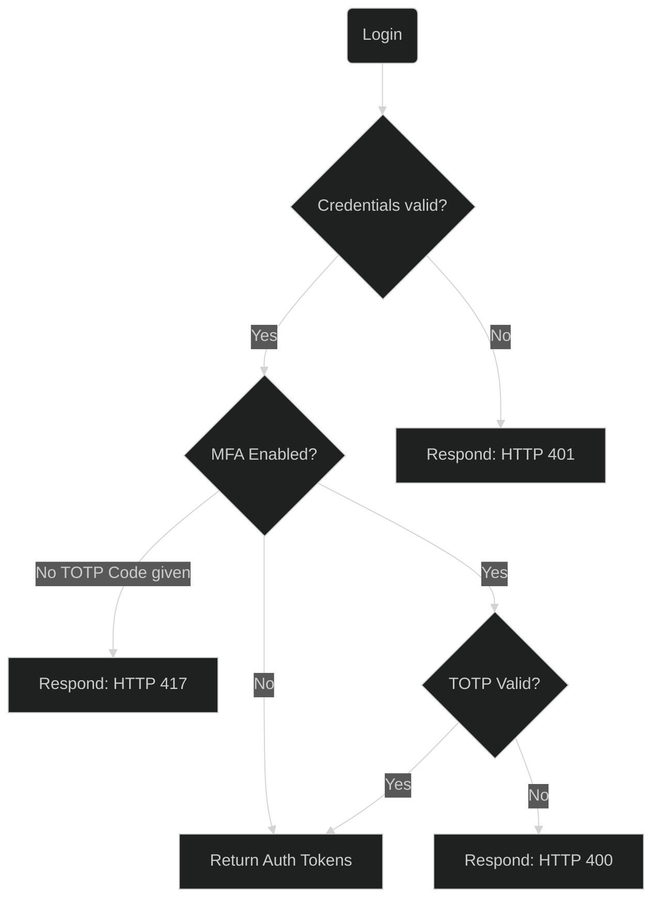

[](https://stand-with-ukraine.pp.ua)

# 🎩 Observer

This project seeks to bridge the gap in tools and systems to support and help internally displaced persons
or in general people in need any kind of support humanitarian, legal or seeking medical help.

## 🌈 Session handling

Motivation behind this is to avoid database queries to verify sessions and keep it as stateless as possible.
To manage sessions we use JWT access tokens and refresh tokens where access token is a short living
token, while refresh tokens will last a lot longer they are used to obtain new access tokens.

### TOTP auth flow

Users will enter email and password which will sent to API then

1. If credentials are valid,
2. And TOTP is enabled,
3. Then return `417 Expectation Failed` response,
4. Given `HTTP 417` response,
5. Then clients should present TOTP code with the same authentication credentials.



## 🍄 Encryption

**NOTE:**

Application depends on set of private keys which then used to encrypt/decrypt generated private keys.

### ❄️ Entity level encryption

For some entities we use encryption for sensitive personal information each of entities
contain a field `encryption_key` which has the following format `system_key_hash:base64_key_contents`
where `system_key_hash` is a hash of a key which is used to encrypt generated private key `base64_key_content`.

### ⚡️ Auth & security

To hash and verify user's passwords we use `passlib` with `bcrypt` and for MFA (TOTP) we use `totp` packages.

#### OTP activation

When users enable MFA the following things happen:
1. Endpoint `POST /mfa/enable` generates TOTP secret,
2. Sends QR code as base64 image and TOTP secret,
3. Client scans and creates OTP client,
4. Then enters TOTP code which,
5. Then sent to `POST /mfa/setup` alongside with secret,
6. On backend we encrypt TOTP code,
7. Then generate backup codes,
8. Then encrypt backup codes,
9. Then save TOTP secret and backup codes and secure encryption key,
10. Then return backup codes to user,
11. Done.

##### Schema level
Users' table and schemas have the following fields the last two of which are encrypted with
private key and if users have MFA enabled we decrypt TOTP secret to verify given TOTP code.
To reset MFA we also keep backup codes in encrypted form and only decrypt to verify if
given backup code is correct.
Both encrypted fields have the following format `system_key_hash:base64_key_contents`.

```py
class User(BaseModel):
    ...
    mfa_enabled: bool
    mfa_encrypted_secret: SomeStr
    mfa_encrypted_backup_codes: SomeStr
```

<hr/>
Made in 🇩🇪 with love from 🇰🇬 & 🇺🇦 for people in need.
