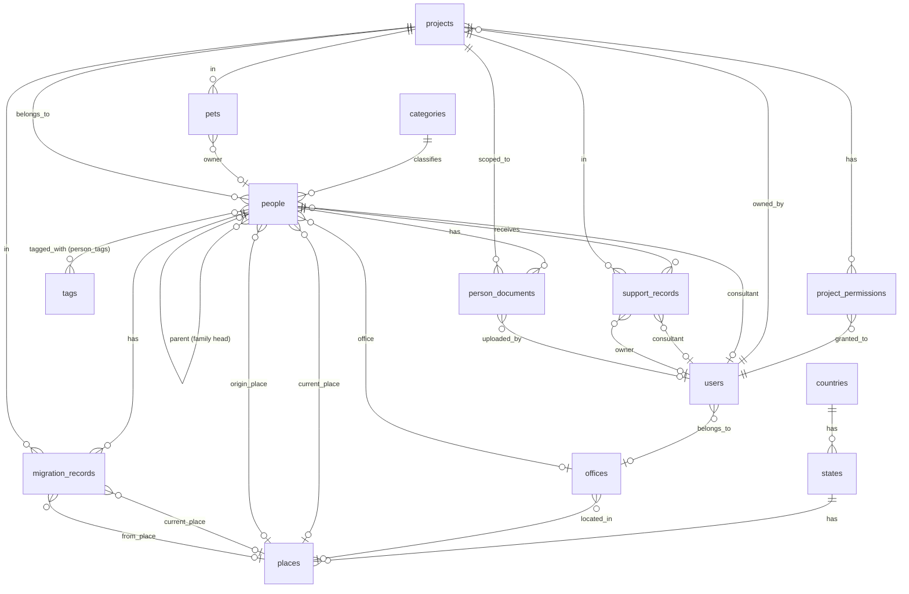

# ADR-003: Main Database Schema

| Field      | Value                      |
| ---------- | -------------------------- |
| Status     | Accepted                   |
| Date       | 2026-02-21                 |
| Supersedes | —                          |
| Components | observer, database, schema |

---

## Context

This ADR defines the main application database schema for Observer — an IDP (Internally Displaced Persons) case management platform. The schema is derived from analysis of the legacy `idp-archive` migrations (16 Alembic migrations + Django models) and refined to:

- Use ULID TEXT primary keys (consistent with ADR-001/002)
- Fix the user role enum to match the IDP domain (`admin/staff/consultant/guest`)
- Replace per-project boolean permission flags with a role enum + sensitivity overrides
- Fix data-model bugs found in the archive (`support_records.owner_id` stored as TEXT with no FK)
- Normalize denormalised patterns (`TEXT[]` tags → junction table)
- Drop redundant derivable columns (`offices.state_id` is implied by `place_id`)
- Clarify ambiguous field names (`from_place_id` → `origin_place_id` on `people`)
- Add composite indexes for the most common query patterns
- Add user profile fields (`first_name`, `last_name`, `office_id`)
- Align naming conventions (`ix_` for indexes, `uq_` for unique constraints)

Migrations are **forward-only** (see ADR-004). Only `.up.sql` files exist.

ADR-002 migrations occupy 000002–000006. This ADR's migrations start at **000007** and continue through **000021**.

Note: ADR-002 migration 000002 (`users` table) is updated in-place to fix the role enum and add profile columns.

---

## Domain Overview

```text
Geography:  countries → states → places (cities/towns/villages)
Org:        offices
Taxonomy:   categories, tags
Projects:   projects, project_permissions
People:     people, person_tags, person_documents
Movement:   migration_records
Support:    support_records
Animals:    pets
```

---

## ER Diagram



---

## Migration Files

### Updated: 000002 — Users (role fix + profile columns)

The ADR-002 users migration is updated to use the correct role enum and add profile fields.
`office_id` is added separately in migration 000021 (after the `offices` table is created in 000010).

**`000002_create_users_table.up.sql`**

```sql
CREATE TABLE users (
    id          TEXT         PRIMARY KEY,
    first_name  TEXT,
    last_name   TEXT,
    email       VARCHAR(255) NOT NULL,
    phone       VARCHAR(20)  NOT NULL,
    role        VARCHAR(50)  NOT NULL CHECK (role IN ('admin', 'staff', 'consultant', 'guest')),
    is_verified BOOLEAN      NOT NULL DEFAULT FALSE,
    is_active   BOOLEAN      NOT NULL DEFAULT TRUE,
    created_at  TIMESTAMPTZ  NOT NULL DEFAULT NOW(),
    updated_at  TIMESTAMPTZ  NOT NULL DEFAULT NOW(),
    CONSTRAINT uq_users_email UNIQUE (email),
    CONSTRAINT uq_users_phone UNIQUE (phone)
);

CREATE INDEX ix_users_email ON users (email);
CREATE INDEX ix_users_phone ON users (phone);
CREATE INDEX ix_users_role  ON users (role);
```

**Platform-level role semantics:**

| Role         | Access                                          |
| ------------ | ----------------------------------------------- |
| `admin`      | Full platform access, user management           |
| `staff`      | Create/manage projects, view all cases          |
| `consultant` | Assigned to projects, works with people records |
| `guest`      | Read-only on explicitly assigned projects       |

---

### 000007 — Countries

**`000007_create_countries_table.up.sql`**

```sql
CREATE TABLE countries (
    id         TEXT        PRIMARY KEY,
    name       TEXT        NOT NULL,
    code       CITEXT      NOT NULL,
    created_at TIMESTAMPTZ NOT NULL DEFAULT NOW(),
    updated_at TIMESTAMPTZ NOT NULL DEFAULT NOW()
);

CREATE UNIQUE INDEX uq_countries_code ON countries (code);
CREATE INDEX        ix_countries_name ON countries (name);
```

---

### 000008 — States

**`000008_create_states_table.up.sql`**

```sql
CREATE TABLE states (
    id         TEXT        PRIMARY KEY,
    country_id TEXT        NOT NULL REFERENCES countries (id) ON DELETE CASCADE,
    name       TEXT        NOT NULL,
    code       CITEXT,
    created_at TIMESTAMPTZ NOT NULL DEFAULT NOW(),
    updated_at TIMESTAMPTZ NOT NULL DEFAULT NOW()
);

CREATE INDEX        ix_states_country_id   ON states (country_id);
CREATE INDEX        ix_states_name         ON states (name);
CREATE UNIQUE INDEX uq_states_country_code ON states (country_id, code) WHERE code IS NOT NULL;
```

---

### 000009 — Places

Places represent cities, towns, villages, or any sub-state geographic unit.

**`000009_create_places_table.up.sql`**

```sql
CREATE TABLE places (
    id         TEXT          PRIMARY KEY,
    state_id   TEXT          NOT NULL REFERENCES states (id) ON DELETE CASCADE,
    name       TEXT          NOT NULL,
    lat        NUMERIC(10,7),
    lon        NUMERIC(10,7),
    created_at TIMESTAMPTZ   NOT NULL DEFAULT NOW(),
    updated_at TIMESTAMPTZ   NOT NULL DEFAULT NOW()
);

CREATE INDEX ix_places_state_id ON places (state_id);
CREATE INDEX ix_places_name     ON places (name);
```

---

### 000010 — Offices

`state_id` dropped — it is derivable via `place → state` when needed.

**`000010_create_offices_table.up.sql`**

```sql
CREATE TABLE offices (
    id         TEXT        PRIMARY KEY,
    name       TEXT        NOT NULL,
    place_id   TEXT        REFERENCES places (id) ON DELETE SET NULL,
    created_at TIMESTAMPTZ NOT NULL DEFAULT NOW(),
    updated_at TIMESTAMPTZ NOT NULL DEFAULT NOW()
);

CREATE UNIQUE INDEX uq_offices_name     ON offices (name);
CREATE INDEX        ix_offices_place_id ON offices (place_id);
```

---

### 000011 — Categories

Taxonomic categories used to classify people (e.g. vulnerability categories).

**`000011_create_categories_table.up.sql`**

```sql
CREATE TABLE categories (
    id          TEXT        PRIMARY KEY,
    name        TEXT        NOT NULL,
    description TEXT,
    created_at  TIMESTAMPTZ NOT NULL DEFAULT NOW(),
    updated_at  TIMESTAMPTZ NOT NULL DEFAULT NOW()
);

CREATE UNIQUE INDEX uq_categories_name ON categories (name);
```

---

### 000012 — Tags

**`000012_create_tags_table.up.sql`**

```sql
CREATE TABLE tags (
    id         TEXT        PRIMARY KEY,
    name       TEXT        NOT NULL,
    created_at TIMESTAMPTZ NOT NULL DEFAULT NOW()
);

CREATE UNIQUE INDEX uq_tags_name ON tags (name);
```

---

### 000013 — Projects

**`000013_create_projects_table.up.sql`**

```sql
CREATE TABLE projects (
    id          TEXT        PRIMARY KEY,
    name        TEXT        NOT NULL,
    description TEXT,
    owner_id    TEXT        NOT NULL REFERENCES users (id) ON DELETE RESTRICT,
    created_at  TIMESTAMPTZ NOT NULL DEFAULT NOW(),
    updated_at  TIMESTAMPTZ NOT NULL DEFAULT NOW()
);

CREATE INDEX ix_projects_owner_id ON projects (owner_id);
CREATE INDEX ix_projects_name     ON projects (name);
```

---

### 000014 — Project Permissions

Per-user, per-project access. Action capabilities derive from `role`; data sensitivity is controlled by explicit boolean flags.

**`000014_create_project_permissions_table.up.sql`**

```sql
CREATE TYPE project_role AS ENUM ('owner', 'manager', 'consultant', 'viewer');

CREATE TABLE project_permissions (
    id                 TEXT         PRIMARY KEY,
    project_id         TEXT         NOT NULL REFERENCES projects (id) ON DELETE CASCADE,
    user_id            TEXT         NOT NULL REFERENCES users (id) ON DELETE CASCADE,
    role               project_role NOT NULL DEFAULT 'viewer',
    can_view_contact   BOOLEAN      NOT NULL DEFAULT FALSE,
    can_view_personal  BOOLEAN      NOT NULL DEFAULT FALSE,
    can_view_documents BOOLEAN      NOT NULL DEFAULT FALSE,
    created_at         TIMESTAMPTZ  NOT NULL DEFAULT NOW(),
    updated_at         TIMESTAMPTZ  NOT NULL DEFAULT NOW()
);

CREATE UNIQUE INDEX uq_project_permissions_user_project ON project_permissions (user_id, project_id);
CREATE INDEX        ix_project_permissions_project_id   ON project_permissions (project_id);
CREATE INDEX        ix_project_permissions_user_id      ON project_permissions (user_id);
```

**Project-role → implied action permissions (enforced in middleware):**

| Role         | read | create | update | delete | manage members     |
| ------------ | ---- | ------ | ------ | ------ | ------------------ |
| `viewer`     | ✓    |        |        |        |                    |
| `consultant` | ✓    | ✓      | ✓      |        |                    |
| `manager`    | ✓    | ✓      | ✓      | ✓      | ✓                  |
| `owner`      | ✓    | ✓      | ✓      | ✓      | ✓ + delete project |

`projects.owner_id` implicitly grants owner-level role — no `project_permissions` row required for the project owner.

---

### 000015 — People

Core IDP case entity. `from_place_id` renamed to `origin_place_id` to unambiguously mean the person's permanent origin, not their last move (which is tracked in `migration_records`).

**`000015_create_people_table.up.sql`**

```sql
CREATE TYPE person_status AS ENUM (
    'active', 'inactive', 'registered',
    'needs_help', 'consulted', 'helped', 'unknown'
);

CREATE TYPE person_sex AS ENUM ('male', 'female', 'other', 'unknown');

CREATE TYPE person_age_group AS ENUM (
    'infant', 'toddler', 'preschool', 'early_school',
    'preteen', 'teen', 'older_teen', 'young_adult',
    'adult', 'senior', 'elderly'
);

CREATE TABLE people (
    id               TEXT             PRIMARY KEY,
    project_id       TEXT             NOT NULL REFERENCES projects (id) ON DELETE RESTRICT,
    parent_id        TEXT             REFERENCES people (id) ON DELETE SET NULL,
    category_id      TEXT             REFERENCES categories (id) ON DELETE SET NULL,
    consultant_id    TEXT             REFERENCES users (id) ON DELETE SET NULL,
    office_id        TEXT             REFERENCES offices (id) ON DELETE SET NULL,
    current_place_id TEXT             REFERENCES places (id) ON DELETE SET NULL,
    origin_place_id  TEXT             REFERENCES places (id) ON DELETE SET NULL,
    external_id      TEXT,
    full_name        TEXT             NOT NULL,
    email            CITEXT,
    birth_date       DATE,
    sex              person_sex       NOT NULL DEFAULT 'unknown',
    age_group        person_age_group,
    phone_numbers    JSONB            NOT NULL DEFAULT '[]',
    status           person_status    NOT NULL DEFAULT 'unknown',
    created_at       TIMESTAMPTZ      NOT NULL DEFAULT NOW(),
    updated_at       TIMESTAMPTZ      NOT NULL DEFAULT NOW()
);

CREATE INDEX ix_people_project_id         ON people (project_id);
CREATE INDEX ix_people_parent_id          ON people (parent_id);
CREATE INDEX ix_people_consultant_id      ON people (consultant_id);
CREATE INDEX ix_people_category_id        ON people (category_id);
CREATE INDEX ix_people_current_place_id   ON people (current_place_id);
CREATE INDEX ix_people_status             ON people (status);
CREATE INDEX ix_people_project_status     ON people (project_id, status);
CREATE INDEX ix_people_project_consultant ON people (project_id, consultant_id);
CREATE INDEX ix_people_full_name          ON people USING gin (full_name gin_trgm_ops);
CREATE INDEX ix_people_email              ON people (email) WHERE email IS NOT NULL;
```

---

### 000016 — Person Tags

Junction table replacing the legacy `TEXT[]` tags column on `people`.

**`000016_create_person_tags_table.up.sql`**

```sql
CREATE TABLE person_tags (
    person_id TEXT NOT NULL REFERENCES people (id) ON DELETE CASCADE,
    tag_id    TEXT NOT NULL REFERENCES tags (id) ON DELETE CASCADE,
    PRIMARY KEY (person_id, tag_id)
);

CREATE INDEX ix_person_tags_tag_id ON person_tags (tag_id);
```

---

### 000017 — Migration Records

Tracks a person's geographic movement over time. `from_place_id` here means the *previous* location (not origin), complementing `people.origin_place_id`.

**`000017_create_migration_records_table.up.sql`**

```sql
CREATE TABLE migration_records (
    id               TEXT        PRIMARY KEY,
    person_id        TEXT        NOT NULL REFERENCES people (id) ON DELETE CASCADE,
    project_id       TEXT        NOT NULL REFERENCES projects (id) ON DELETE RESTRICT,
    current_place_id TEXT        REFERENCES places (id) ON DELETE SET NULL,
    from_place_id    TEXT        REFERENCES places (id) ON DELETE SET NULL,
    migration_date   DATE,
    notes            TEXT,
    created_at       TIMESTAMPTZ NOT NULL DEFAULT NOW(),
    updated_at       TIMESTAMPTZ NOT NULL DEFAULT NOW()
);

CREATE INDEX ix_migration_records_person_id        ON migration_records (person_id);
CREATE INDEX ix_migration_records_project_id       ON migration_records (project_id);
CREATE INDEX ix_migration_records_current_place_id ON migration_records (current_place_id);
```

---

### 000018 — Support Records

Tracks assistance provided to a person. `owner_id` is corrected from `TEXT` (archive bug) to a proper FK referencing `users`.

**`000018_create_support_records_table.up.sql`**

```sql
CREATE TYPE support_type AS ENUM ('humanitarian', 'legal', 'medical', 'general');

CREATE TABLE support_records (
    id            TEXT         PRIMARY KEY,
    person_id     TEXT         NOT NULL REFERENCES people (id) ON DELETE CASCADE,
    project_id    TEXT         NOT NULL REFERENCES projects (id) ON DELETE RESTRICT,
    consultant_id TEXT         REFERENCES users (id) ON DELETE SET NULL,
    owner_id      TEXT         REFERENCES users (id) ON DELETE SET NULL,
    type          support_type NOT NULL DEFAULT 'general',
    notes         TEXT,
    created_at    TIMESTAMPTZ  NOT NULL DEFAULT NOW(),
    updated_at    TIMESTAMPTZ  NOT NULL DEFAULT NOW()
);

CREATE INDEX ix_support_records_person_id     ON support_records (person_id);
CREATE INDEX ix_support_records_project_id    ON support_records (project_id);
CREATE INDEX ix_support_records_consultant_id ON support_records (consultant_id);
CREATE INDEX ix_support_records_type          ON support_records (type);
```

---

### 000019 — Pets

Animals associated with a project. `owner_id` references `people` (not `users`) — the pet owner is a displaced person, not a platform user.

**`000019_create_pets_table.up.sql`**

```sql
CREATE TYPE pet_status AS ENUM (
    'registered', 'adopted', 'owner_found', 'needs_shelter', 'unknown'
);

CREATE TABLE pets (
    id              TEXT        PRIMARY KEY,
    project_id      TEXT        NOT NULL REFERENCES projects (id) ON DELETE RESTRICT,
    owner_id        TEXT        REFERENCES people (id) ON DELETE SET NULL,
    name            TEXT        NOT NULL,
    status          pet_status  NOT NULL DEFAULT 'unknown',
    registration_id TEXT,
    notes           TEXT,
    created_at      TIMESTAMPTZ NOT NULL DEFAULT NOW(),
    updated_at      TIMESTAMPTZ NOT NULL DEFAULT NOW()
);

CREATE INDEX ix_pets_project_id ON pets (project_id);
CREATE INDEX ix_pets_owner_id   ON pets (owner_id);
CREATE INDEX ix_pets_status     ON pets (status);
```

---

### 000020 — Person Documents

Documents scoped to a person and project. `encryption_key` is null for unencrypted files.

**`000020_create_person_documents_table.up.sql`**

```sql
CREATE TABLE person_documents (
    id             TEXT        PRIMARY KEY,
    person_id      TEXT        NOT NULL REFERENCES people (id) ON DELETE CASCADE,
    project_id     TEXT        NOT NULL REFERENCES projects (id) ON DELETE RESTRICT,
    uploaded_by    TEXT        REFERENCES users (id) ON DELETE SET NULL,
    encryption_key TEXT,
    name           TEXT        NOT NULL,
    path           TEXT        NOT NULL,
    mime_type      TEXT        NOT NULL,
    size           BIGINT      NOT NULL DEFAULT 0,
    created_at     TIMESTAMPTZ NOT NULL DEFAULT NOW()
);

CREATE INDEX ix_person_documents_person_id  ON person_documents (person_id);
CREATE INDEX ix_person_documents_project_id ON person_documents (project_id);
```

---

### 000021 — Add Office to Users

Adds `office_id` to `users` after the `offices` table exists (000010). Kept as a separate migration to avoid a circular dependency in the initial users table (000002).

**`000021_add_office_to_users.up.sql`**

```sql
ALTER TABLE users ADD COLUMN office_id TEXT REFERENCES offices (id) ON DELETE SET NULL;

CREATE INDEX ix_users_office_id ON users (office_id);
```

---

## Design Decisions

### Forward-Only Migrations

Per ADR-004, no `.down.sql` files exist. All schema changes are expressed as new forward migrations.

### Role-based Project Permissions

Replacing 4 action booleans (`can_read/create/update/delete`) with a `project_role` enum eliminates 15 meaningless flag combinations and moves authorization logic into a single switch in middleware. The 3 sensitivity flags (`can_view_contact/personal/documents`) remain per-user because data access is genuinely individual.

### `offices.state_id` Removed

Derivable via `offices.place_id → places.state_id`. Keeping it would require a trigger or application-level enforcement to prevent inconsistency.

### `origin_place_id` vs `from_place_id`

On `people`: `origin_place_id` = hometown (permanent, set once).
On `migration_records`: `from_place_id` = previous location in a specific movement event.
This naming makes the distinction explicit and avoids a common confusion from the archive.

### Tags Normalized to Junction Table

`TEXT[]` prevents efficient reverse lookup ("all people with tag X"), atomic rename, and referential integrity. The `tags` + `person_tags` pattern solves all three.

### `support_records.owner_id` Bug Fix

Archive migration `15af2b04e333_16_support.py` declared `owner_id = Column(Text)` with no FK. Corrected to `TEXT REFERENCES users (id) ON DELETE SET NULL`.

### `pets.owner_id` → `people`

In an IDP context the pet owner is a displaced person, not a platform user. Updated from the archive's `users` FK.

### `person_documents` Scoped to Person

The archive linked documents only to projects. Making `person_id` NOT NULL ensures every document has an explicit person context for access control decisions.

### No Audit Logs Table

Audit logging is deferred: it adds operational complexity (retention, partitioning, volume) without a defined consumer today. When needed, implement as a separate append-only store (e.g. partitioned table, dedicated service, or Postgres logical replication consumer) rather than a general-purpose JSONB table.

### Phone Numbers as JSONB

`JSONB` array (e.g. `[{"type":"mobile","number":"+380501234567"}]`) handles multiple numbers per person without a join table. A dedicated `person_phones` table is a straightforward future normalisation if phone-level querying becomes a requirement.

### CITEXT for Case-insensitive Lookups

`email` fields and geographic codes use `CITEXT` (enabled in migration 000001) to avoid application-level `.ToLower()` normalisation at insert and query time.

### gin_trgm Index on Full Name

`ix_people_full_name` uses `gin_trgm_ops` (requires `pg_trgm` from migration 000001) for efficient `ILIKE '%partial name%'` and similarity searches — essential for case worker lookup workflows.

---

## Summary of Migration Numbers

| Number | Table / Change          |
| ------ | ----------------------- |
| 000002 | users (updated)         |
| 000007 | countries               |
| 000008 | states                  |
| 000009 | places                  |
| 000010 | offices                 |
| 000011 | categories              |
| 000012 | tags                    |
| 000013 | projects                |
| 000014 | project_permissions     |
| 000015 | people                  |
| 000016 | person_tags             |
| 000017 | migration_records       |
| 000018 | support_records         |
| 000019 | pets                    |
| 000020 | person_documents        |
| 000021 | users office_id (alter) |
