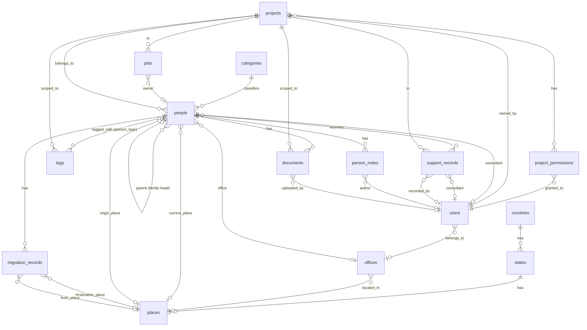

# ADR-003: Main Database Schema

| Field      | Value                      |
| ---------- | -------------------------- |
| Status     | Accepted                   |
| Date       | 2026-02-21                 |
| Supersedes | —                          |
| Components | observer, database, schema |

---

## Context

This ADR defines the main application database schema for Observer — an IDP (Internally Displaced Persons) case management platform. The schema is derived from analysis of the legacy `idp-archive` migrations (16 Alembic migrations + Django models) and refined to:

- Use ULID TEXT primary keys (consistent with ADR-001/002)
- Fix the user role enum to match the IDP domain (`admin/staff/consultant/guest`)
- Replace per-project boolean permission flags with a role enum + sensitivity overrides
- Fix data-model bugs found in the archive (`support_records.owner_id` stored as TEXT with no FK)
- Normalize denormalised patterns (`TEXT[]` tags → junction table)
- Drop redundant derivable columns (`offices.state_id` implied by `place_id`)
- Clarify ambiguous field names throughout
- Add composite indexes for the most common query patterns
- Add user profile fields (`first_name`, `last_name`, `office_id`)
- Align naming conventions (`ix_` for indexes, `uq_` for unique constraints)
- Incorporate all schema refinements identified in the second-pass review (see Design Decisions)

Migrations are **forward-only** (see ADR-004). Only `.up.sql` files exist.

ADR-002 migrations occupy 000002–000006. This ADR's migrations start at **000007** and end at **000022**.

---

## Domain Overview

```text
Geography:  countries → states → places (cities/towns/villages)
Org:        offices
Taxonomy:   categories, tags (project-scoped)
Projects:   projects, project_permissions
People:     people, person_tags, person_notes, documents
Movement:   migration_records
Support:    support_records
Animals:    pets
```

---

## ER Diagram



---

## Migration Files

### Updated: 000002 — Users (role fix + profile columns)

The ADR-002 users migration is updated in-place to use the correct role enum and add profile fields.
`office_id` is added separately in migration 000021 (after `offices` is created in 000010).

```sql
CREATE TABLE users (
    id          TEXT         PRIMARY KEY,
    first_name  TEXT,
    last_name   TEXT,
    email       VARCHAR(255) NOT NULL,
    phone       VARCHAR(20)  NOT NULL,
    role        VARCHAR(50)  NOT NULL CHECK (role IN ('admin', 'staff', 'consultant', 'guest')),
    is_verified BOOLEAN      NOT NULL DEFAULT FALSE,
    is_active   BOOLEAN      NOT NULL DEFAULT TRUE,
    created_at  TIMESTAMPTZ  NOT NULL DEFAULT NOW(),
    updated_at  TIMESTAMPTZ  NOT NULL DEFAULT NOW(),
    CONSTRAINT uq_users_email UNIQUE (email),
    CONSTRAINT uq_users_phone UNIQUE (phone)
);
```

**Platform-level role semantics:**

| Role         | Access                                          |
| ------------ | ----------------------------------------------- |
| `admin`      | Full platform access, user management           |
| `staff`      | Create/manage projects, view all cases          |
| `consultant` | Assigned to projects, works with people records |
| `guest`      | Read-only on explicitly assigned projects       |

---

### 000007 — Countries

```sql
CREATE TABLE countries (
    id         TEXT        PRIMARY KEY,
    name       TEXT        NOT NULL,
    code       CITEXT      NOT NULL,
    created_at TIMESTAMPTZ NOT NULL DEFAULT NOW(),
    updated_at TIMESTAMPTZ NOT NULL DEFAULT NOW()
);

CREATE UNIQUE INDEX uq_countries_code ON countries (code);
CREATE INDEX        ix_countries_name ON countries (name);
```

---

### 000008 — States

```sql
CREATE TABLE states (
    id         TEXT        PRIMARY KEY,
    country_id TEXT        NOT NULL REFERENCES countries (id) ON DELETE CASCADE,
    name       TEXT        NOT NULL,
    code       CITEXT,
    created_at TIMESTAMPTZ NOT NULL DEFAULT NOW(),
    updated_at TIMESTAMPTZ NOT NULL DEFAULT NOW()
);

CREATE INDEX        ix_states_country_id   ON states (country_id);
CREATE INDEX        ix_states_name         ON states (name);
CREATE UNIQUE INDEX uq_states_country_code ON states (country_id, code) WHERE code IS NOT NULL;
```

---

### 000009 — Places

Places represent cities, towns, villages, or any sub-state geographic unit.

```sql
CREATE TABLE places (
    id         TEXT          PRIMARY KEY,
    state_id   TEXT          NOT NULL REFERENCES states (id) ON DELETE CASCADE,
    name       TEXT          NOT NULL,
    lat        NUMERIC(10,7),
    lon        NUMERIC(10,7),
    created_at TIMESTAMPTZ   NOT NULL DEFAULT NOW(),
    updated_at TIMESTAMPTZ   NOT NULL DEFAULT NOW()
);

CREATE INDEX ix_places_state_id ON places (state_id);
CREATE INDEX ix_places_name     ON places (name);
```

---

### 000010 — Offices

`state_id` dropped — derivable via `place_id → places.state_id`. No global name uniqueness — different cities legitimately share office names (e.g. "Main Office" in Kyiv and Kherson).

```sql
CREATE TABLE offices (
    id         TEXT        PRIMARY KEY,
    name       TEXT        NOT NULL,
    place_id   TEXT        REFERENCES places (id) ON DELETE SET NULL,
    created_at TIMESTAMPTZ NOT NULL DEFAULT NOW(),
    updated_at TIMESTAMPTZ NOT NULL DEFAULT NOW()
);

CREATE INDEX ix_offices_place_id ON offices (place_id);
```

---

### 000011 — Categories

Structured vulnerability categories for classifying people (e.g. elderly, disabled, single parent).
Distinct from tags: categories are predefined and a person has exactly one; tags are free-form and many.

```sql
CREATE TABLE categories (
    id          TEXT        PRIMARY KEY,
    name        TEXT        NOT NULL,
    description TEXT,
    created_at  TIMESTAMPTZ NOT NULL DEFAULT NOW(),
    updated_at  TIMESTAMPTZ NOT NULL DEFAULT NOW()
);

CREATE UNIQUE INDEX uq_categories_name ON categories (name);
```

---

### 000012 — Tags

Project-scoped free-form labels. Tags are unique per project, not globally — each project maintains its own tag vocabulary independently.

```sql
CREATE TABLE tags (
    id         TEXT        PRIMARY KEY,
    project_id TEXT        NOT NULL REFERENCES projects (id) ON DELETE CASCADE,
    name       TEXT        NOT NULL,
    created_at TIMESTAMPTZ NOT NULL DEFAULT NOW()
);

CREATE UNIQUE INDEX uq_tags_project_name ON tags (project_id, name);
CREATE INDEX        ix_tags_project_id   ON tags (project_id);
```

---

### 000013 — Projects

```sql
CREATE TABLE projects (
    id          TEXT        PRIMARY KEY,
    name        TEXT        NOT NULL,
    description TEXT,
    owner_id    TEXT        NOT NULL REFERENCES users (id) ON DELETE RESTRICT,
    status      VARCHAR(20) NOT NULL DEFAULT 'active'
                    CHECK (status IN ('active', 'archived', 'closed')),
    created_at  TIMESTAMPTZ NOT NULL DEFAULT NOW(),
    updated_at  TIMESTAMPTZ NOT NULL DEFAULT NOW()
);

CREATE INDEX ix_projects_owner_id ON projects (owner_id);
CREATE INDEX ix_projects_name     ON projects (name);
CREATE INDEX ix_projects_status   ON projects (status);
```

Project lifecycle: `active` → `archived` (read-only, retained) or `closed` (ended).

---

### 000014 — Project Permissions

Per-user, per-project access. Action capabilities derive from `role`; data sensitivity is controlled by explicit boolean flags.

```sql
CREATE TYPE project_role AS ENUM ('owner', 'manager', 'consultant', 'viewer');

CREATE TABLE project_permissions (
    id                 TEXT         PRIMARY KEY,
    project_id         TEXT         NOT NULL REFERENCES projects (id) ON DELETE CASCADE,
    user_id            TEXT         NOT NULL REFERENCES users (id) ON DELETE CASCADE,
    role               project_role NOT NULL DEFAULT 'viewer',
    can_view_contact   BOOLEAN      NOT NULL DEFAULT FALSE,
    can_view_personal  BOOLEAN      NOT NULL DEFAULT FALSE,
    can_view_documents BOOLEAN      NOT NULL DEFAULT FALSE,
    created_at         TIMESTAMPTZ  NOT NULL DEFAULT NOW(),
    updated_at         TIMESTAMPTZ  NOT NULL DEFAULT NOW()
);

CREATE UNIQUE INDEX uq_project_permissions_user_project ON project_permissions (user_id, project_id);
CREATE INDEX        ix_project_permissions_project_id   ON project_permissions (project_id);
CREATE INDEX        ix_project_permissions_user_id      ON project_permissions (user_id);
```

**Project-role → implied action permissions (enforced in middleware):**

| Role         | read | create | update | delete | manage members     |
| ------------ | ---- | ------ | ------ | ------ | ------------------ |
| `viewer`     | ✓    |        |        |        |                    |
| `consultant` | ✓    | ✓      | ✓      |        |                    |
| `manager`    | ✓    | ✓      | ✓      | ✓      | ✓                  |
| `owner`      | ✓    | ✓      | ✓      | ✓      | ✓ + delete project |

`projects.owner_id` implicitly grants owner-level role — no `project_permissions` row required for the project owner.

---

### 000015 — People

Core IDP case entity.

- `first_name` / `last_name` / `patronymic` — split from the archive's `full_name`; enables per-field GIN search and proper surname sorting
- `idp_status` — IDP geographic origin; required for Crimea / East Ukraine / non-IDP report breakdowns
- `case_status` — clean lifecycle enum replacing the archive's mixed-concern `status` field
- `registered_at DATE` — the actual date a person was registered with the office (distinct from `created_at`, which is the DB insertion timestamp; see ADR-005 §registered_at)
- `origin_place_id` — permanent hometown; movement history is in `migration_records`
- `birth_date` and `age_group` are mutually exclusive (XOR constraint); age group ranges defined in ADR-005

```sql
CREATE TYPE person_case_status AS ENUM ('new', 'active', 'closed', 'archived');
CREATE TYPE person_sex AS ENUM ('male', 'female', 'other', 'unknown');
CREATE TYPE person_age_group AS ENUM (
    'infant', 'toddler', 'pre_school', 'middle_childhood',
    'young_teen', 'teenager', 'young_adult', 'early_adult',
    'middle_aged_adult', 'old_adult', 'unknown'
);

CREATE TABLE people (
    id               TEXT               PRIMARY KEY,
    project_id       TEXT               NOT NULL REFERENCES projects (id) ON DELETE RESTRICT,
    parent_id        TEXT               REFERENCES people (id) ON DELETE SET NULL,
    category_id      TEXT               REFERENCES categories (id) ON DELETE SET NULL,
    consultant_id    TEXT               REFERENCES users (id) ON DELETE SET NULL,
    office_id        TEXT               REFERENCES offices (id) ON DELETE SET NULL,
    current_place_id TEXT               REFERENCES places (id) ON DELETE SET NULL,
    origin_place_id  TEXT               REFERENCES places (id) ON DELETE SET NULL,
    external_id      TEXT,
    first_name       TEXT               NOT NULL,
    last_name        TEXT,
    patronymic       TEXT,
    email            CITEXT,
    birth_date       DATE,
    sex              person_sex         NOT NULL DEFAULT 'unknown',
    age_group        person_age_group,
    phone_numbers    JSONB              NOT NULL DEFAULT '[]',
    idp_status       TEXT               CHECK (idp_status IN ('crimea', 'east_ukraine', 'non_idp')),
    case_status      person_case_status NOT NULL DEFAULT 'new',
    registered_at    DATE,
    created_at       TIMESTAMPTZ        NOT NULL DEFAULT NOW(),
    updated_at       TIMESTAMPTZ        NOT NULL DEFAULT NOW(),
    CONSTRAINT chk_people_age_xor CHECK (birth_date IS NULL OR age_group IS NULL)
);
```

---

### 000016 — Person Tags

Junction table replacing the legacy `TEXT[]` tags column on `people`.

```sql
CREATE TABLE person_tags (
    person_id TEXT NOT NULL REFERENCES people (id) ON DELETE CASCADE,
    tag_id    TEXT NOT NULL REFERENCES tags (id) ON DELETE CASCADE,
    PRIMARY KEY (person_id, tag_id)
);

CREATE INDEX ix_person_tags_tag_id ON person_tags (tag_id);
```

---

### 000017 — Migration Records

Tracks a person's geographic movement over time. These are immutable historical facts.

- `from_place_id` — where the person was before this move
- `destination_place_id` — where the person moved to
- `project_id` omitted — derivable via `person_id → people.project_id`
- `updated_at` omitted — corrections are new records, not edits

```sql
CREATE TABLE migration_records (
    id                   TEXT        PRIMARY KEY,
    person_id            TEXT        NOT NULL REFERENCES people (id) ON DELETE CASCADE,
    destination_place_id TEXT        REFERENCES places (id) ON DELETE SET NULL,
    from_place_id        TEXT        REFERENCES places (id) ON DELETE SET NULL,
    migration_date       DATE,
    notes                TEXT,
    created_at           TIMESTAMPTZ NOT NULL DEFAULT NOW()
);

CREATE INDEX ix_migration_records_person_id            ON migration_records (person_id);
CREATE INDEX ix_migration_records_destination_place_id ON migration_records (destination_place_id);
```

---

### 000018 — Support Records

Tracks assistance provided to a person.

- `recorded_by` — user who entered the record (was `owner_id` in archive, which had no FK)
- `consultant_id` — consultant who delivered the service
- `office_id` — the office that provided or coordinated this consultation (direct FK, not derived through the consultant's home office — see ADR-005 §office_id)
- `provided_at` — date service was delivered (distinct from `created_at`, the DB insertion time)
- `sphere` — topic area for "by sphere of appeal" report breakdowns; constrained to `support_sphere` enum values (see ADR-005)

```sql
CREATE TYPE support_type AS ENUM (
    'humanitarian', 'legal', 'social', 'psychological', 'medical', 'general'
);

CREATE TYPE support_sphere AS ENUM (
    'housing_assistance', 'document_recovery', 'social_benefits', 'property_rights',
    'employment_rights', 'family_law', 'healthcare_access', 'education_access',
    'financial_aid', 'psychological_support', 'other'
);

CREATE TABLE support_records (
    id            TEXT           PRIMARY KEY,
    person_id     TEXT           NOT NULL REFERENCES people (id) ON DELETE CASCADE,
    project_id    TEXT           NOT NULL REFERENCES projects (id) ON DELETE RESTRICT,
    consultant_id TEXT           REFERENCES users (id) ON DELETE SET NULL,
    recorded_by   TEXT           REFERENCES users (id) ON DELETE SET NULL,
    office_id     TEXT           REFERENCES offices (id) ON DELETE SET NULL,
    type          support_type   NOT NULL DEFAULT 'general',
    sphere        support_sphere,
    provided_at   DATE,
    notes         TEXT,
    created_at    TIMESTAMPTZ    NOT NULL DEFAULT NOW(),
    updated_at    TIMESTAMPTZ    NOT NULL DEFAULT NOW()
);

CREATE INDEX ix_support_records_person_id     ON support_records (person_id);
CREATE INDEX ix_support_records_project_id    ON support_records (project_id);
CREATE INDEX ix_support_records_consultant_id ON support_records (consultant_id);
CREATE INDEX ix_support_records_type          ON support_records (type);
CREATE INDEX ix_support_records_provided_at   ON support_records (provided_at);
CREATE INDEX ix_support_records_sphere        ON support_records (sphere) WHERE sphere IS NOT NULL;
```

---

### 000019 — Pets

Animals associated with a project. `owner_id` references `people` (not `users`) — the pet owner is a displaced person, not a platform user.

```sql
CREATE TYPE pet_status AS ENUM (
    'registered', 'adopted', 'owner_found', 'needs_shelter', 'unknown'
);

CREATE TABLE pets (
    id              TEXT        PRIMARY KEY,
    project_id      TEXT        NOT NULL REFERENCES projects (id) ON DELETE RESTRICT,
    owner_id        TEXT        REFERENCES people (id) ON DELETE SET NULL,
    name            TEXT        NOT NULL,
    status          pet_status  NOT NULL DEFAULT 'unknown',
    registration_id TEXT,
    notes           TEXT,
    created_at      TIMESTAMPTZ NOT NULL DEFAULT NOW(),
    updated_at      TIMESTAMPTZ NOT NULL DEFAULT NOW()
);
```

---

### 000020 — Documents

Documents attached to a person record, scoped to a project.

- `path` — relative path from the storage root
- `encryption_key_ref` — KMS key identifier (not raw key material); null for unencrypted files

```sql
CREATE TABLE documents (
    id                 TEXT        PRIMARY KEY,
    person_id          TEXT        NOT NULL REFERENCES people (id) ON DELETE CASCADE,
    project_id         TEXT        NOT NULL REFERENCES projects (id) ON DELETE RESTRICT,
    uploaded_by        TEXT        REFERENCES users (id) ON DELETE SET NULL,
    encryption_key_ref TEXT,
    name               TEXT        NOT NULL,
    path               TEXT        NOT NULL,
    mime_type          TEXT        NOT NULL,
    size               BIGINT      NOT NULL DEFAULT 0,
    created_at         TIMESTAMPTZ NOT NULL DEFAULT NOW()
);

CREATE INDEX ix_documents_person_id  ON documents (person_id);
CREATE INDEX ix_documents_project_id ON documents (project_id);
```

---

### 000021 — Add Office to Users

Adds `office_id` to `users` after `offices` exists (000010). Kept separate to avoid a circular dependency.

```sql
ALTER TABLE users ADD COLUMN office_id TEXT REFERENCES offices (id) ON DELETE SET NULL;
CREATE INDEX ix_users_office_id ON users (office_id);
```

---

### 000022 — Person Notes

Informal case-worker notes on a person record. Distinct from `support_records` (formal, quantified service events) — notes are internal observations and reminders.

```sql
CREATE TABLE person_notes (
    id         TEXT        PRIMARY KEY,
    person_id  TEXT        NOT NULL REFERENCES people (id) ON DELETE CASCADE,
    author_id  TEXT        REFERENCES users (id) ON DELETE SET NULL,
    body       TEXT        NOT NULL,
    created_at TIMESTAMPTZ NOT NULL DEFAULT NOW()
);

CREATE INDEX ix_person_notes_person_id ON person_notes (person_id);
CREATE INDEX ix_person_notes_author_id ON person_notes (author_id);
```

---

## Design Decisions

### Forward-Only Migrations

Per ADR-004, no `.down.sql` files exist. All schema changes are expressed as new forward migrations. Where a schema is revised during development before production deployment, the original migration file is updated in-place.

### Role-based Project Permissions

Replacing 4 action booleans (`can_read/create/update/delete`) with a `project_role` enum eliminates 15 meaningless flag combinations and moves authorization logic into a single switch in middleware. The 3 sensitivity flags (`can_view_contact/personal/documents`) remain per-user because data access is genuinely individual.

### `offices.state_id` Removed

Derivable via `offices.place_id → places.state_id`. Storing it directly creates a denormalization that can drift out of sync and requires a trigger or application enforcement to maintain.

### Office Name Uniqueness Removed

A global unique constraint on `offices.name` was too broad — different cities legitimately have offices with the same name. Uniqueness at a regional level is an application-layer concern.

### `origin_place_id` vs `from_place_id`

On `people`: `origin_place_id` = permanent hometown (biographical fact, set once).
On `migration_records`: `from_place_id` = previous location in a specific movement event.
This naming makes the distinction explicit and avoids the ambiguity in the archive.

### Tags Scoped to Projects

Global tag namespaces cause tag vocabulary pollution across unrelated projects. Project-scoped tags (`uq_tags_project_name`) allow each project to define its own vocabulary independently.

### People: Split Name Fields

`full_name TEXT` prevents per-field search, surname sorting, and display formatting. `first_name` / `last_name` / `patronymic` (patronymic is common in Ukrainian naming conventions) enables GIN trigram indexes on each field independently.

### People: `case_status` Replaces `status`

The archive's `person_status` enum mixed lifecycle states (`active/inactive`) with workflow milestones (`needs_help/consulted/helped`). The new `person_case_status` (`new/active/closed/archived`) models only the case lifecycle. Workflow progression is observable through the presence and content of `support_records` and `migration_records`.

### People: `idp_status`

Report requirements (ADR-005) need breakdowns by IDP geographic origin (Crimea / East Ukraine ATO / non-IDP). This is not reliably inferrable from `origin_place_id` alone — the same city may have both IDP and local-resident records. An explicit `idp_status` field is unambiguous.

### People: Age XOR Constraint

`birth_date` and `age_group` are two input methods for age information. Both stored simultaneously can contradict. The `chk_people_age_xor` constraint prevents this at the database level. Age group ranges and bucket computation from `birth_date` are defined in ADR-005 §Group 8.

### People: `registered_at`

`created_at` is the database insertion timestamp. Batch imports from field visits give all rows the same `created_at`. `registered_at DATE` records the actual date a person was formally registered with the office. All registration-window reports use `registered_at`; it is nullable for records where the original date is unknown.

### Migration Records: Immutable Facts

Movement events are historical records. An `updated_at` column implies editability, which undermines the audit trail. Corrections are expressed by adding a new record; the incorrect one can be flagged or deleted. `project_id` is redundant — always derivable via `person_id → people.project_id`.

### Support Records: `provided_at` vs `created_at`

`created_at` is the DB insertion timestamp. `provided_at` is when the service was actually delivered — these can differ significantly (e.g. bulk data entry after field visits). All date-range filtering in reports must use `provided_at`.

### Support Records: `recorded_by`

The archive's `owner_id = Column(Text)` had no FK, allowing arbitrary strings. Corrected to `TEXT REFERENCES users (id) ON DELETE SET NULL` and renamed to `recorded_by` to clearly identify this as the data-entry user (distinct from `consultant_id`, the service deliverer).

### Support Records: `office_id`

Office attribution is a direct FK on `support_records`, not derived through `consultant_id → users.office_id`. A consultant from the Kyiv office may provide a consultation coordinated by the Kherson office during a field visit — indirect routing would misattribute it. The providing office is recorded explicitly at the time of entry.

### Support Type: `social` and `psychological`

The report specification explicitly distinguishes legal vs social consultations as the primary breakdown axis. `social` is a domain term in Ukrainian social work (distinct from humanitarian material aid). `psychological` covers counselling services.

### Support Sphere: constrained enum

`sphere` uses a `support_sphere` enum type rather than free text. Free text causes GROUP BY fragmentation ("housing" vs "housing assistance" appearing as separate buckets). New sphere values are added via `ALTER TYPE support_sphere ADD VALUE` in a forward migration. All values follow snake_case convention.

### Documents Table

Named `documents` rather than `person_documents` — the person context is already provided by the mandatory `person_id` FK. `encryption_key_ref` stores a KMS key identifier, never raw key material. `path` is a relative path from the configurable storage root.

### No Audit Logs Table

Audit logging is deferred: it adds operational complexity (retention, partitioning, volume) without a defined consumer today. When needed, implement as a separate append-only store rather than a general-purpose JSONB table.

### Phone Numbers as JSONB

`JSONB` array handles multiple numbers per person without a join table. A dedicated `person_phones` table is a straightforward future normalisation if phone-level querying becomes a requirement.

### CITEXT for Case-insensitive Lookups

`email` fields and geographic codes use `CITEXT` to avoid application-level normalisation.

### GIN Trigram Indexes on Name Fields

`ix_people_first_name` and `ix_people_last_name` use `gin_trgm_ops` for efficient `ILIKE '%partial%'` searches — essential for case worker lookup workflows.

---

## Summary of Migration Numbers

| Number | Table / Change                                              |
| ------ | ----------------------------------------------------------- |
| 000002 | users (role fix, profile columns)                           |
| 000007 | countries                                                   |
| 000008 | states                                                      |
| 000009 | places                                                      |
| 000010 | offices (no state_id, no global name unique)                |
| 000011 | categories                                                  |
| 000012 | tags (project-scoped)                                       |
| 000013 | projects (+ status)                                         |
| 000014 | project_permissions (project_role enum + sensitivity flags) |
| 000015 | people (split name, idp_status, case_status, age XOR)       |
| 000016 | person_tags                                                 |
| 000017 | migration_records (destination_place_id, immutable)         |
| 000018 | support_records (recorded_by, provided_at, sphere)          |
| 000019 | pets (owner → people)                                       |
| 000020 | documents (renamed from person_documents)                   |
| 000021 | users office_id (alter)                                     |
| 000022 | person_notes                                                |
