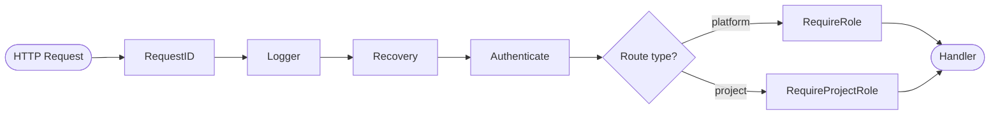
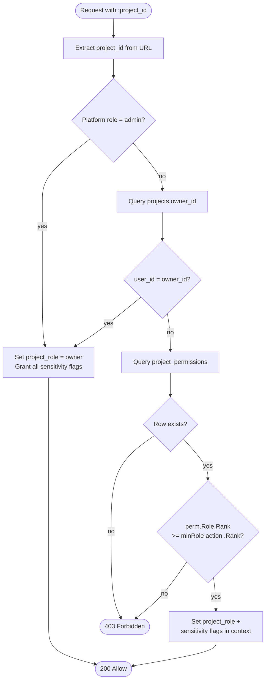
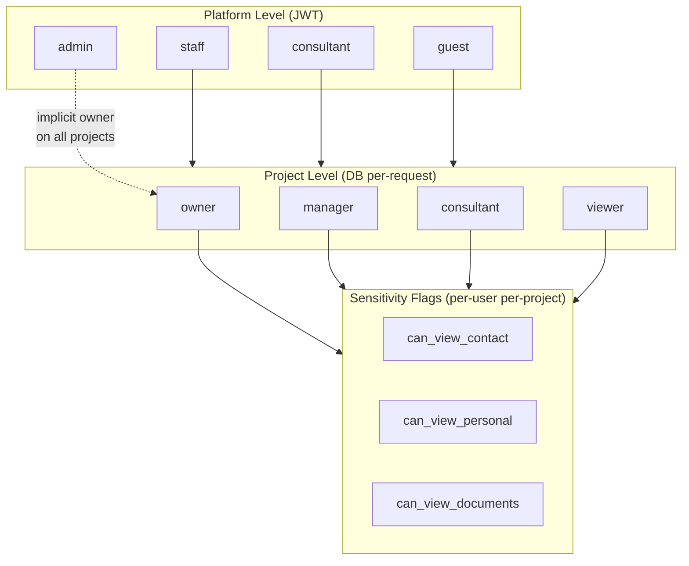
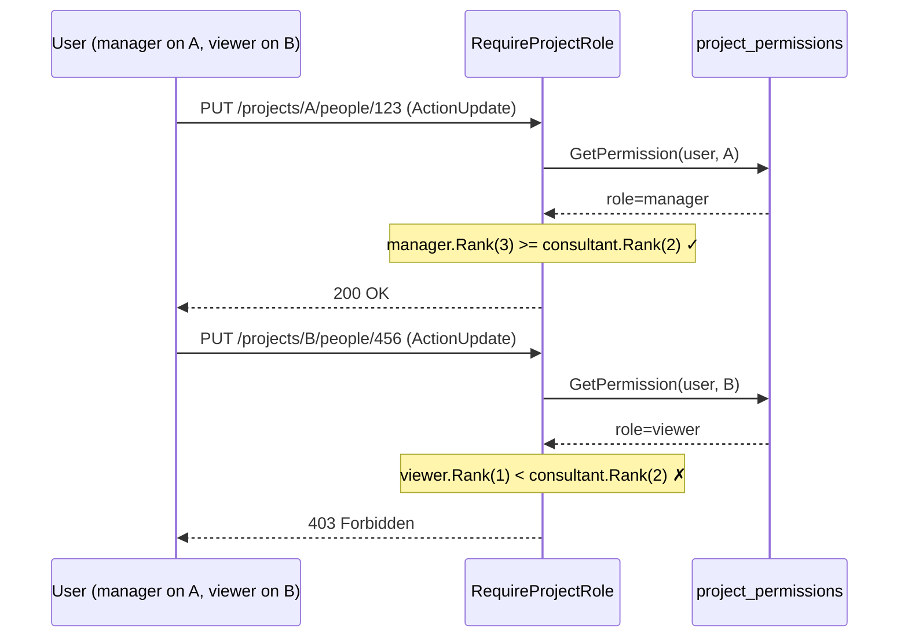

# ADR-006: Authorization Middleware

| Field      | Value                               |
| ---------- | ----------------------------------- |
| Status     | Accepted                            |
| Date       | 2026-02-22                          |
| Supersedes | —                                   |
| Components | observer, middleware, authorization |

---

## Context

ADR-002 introduced `Authenticate()` and `RequireRole(roles ...string)` middleware. `Authenticate()` validates the JWT and sets `user_id` + `user_role` in the Gin context. `RequireRole` checks the platform-level role against an allow-list.

This is sufficient for auth endpoints but not for resource APIs. ADR-003 defines a dual-level RBAC model:

1. **Platform roles** (`admin`, `staff`, `consultant`, `guest`) — stored in JWT claims, gate coarse access
2. **Project roles** (`owner`, `manager`, `consultant`, `viewer`) — stored in `project_permissions` table, gate per-project actions
3. **Sensitivity flags** (`can_view_contact`, `can_view_personal`, `can_view_documents`) — per-user per-project, control field-level visibility

The current middleware has two gaps:

- `RequireRole` accepts raw strings — no compile-time safety, easy to typo `"adimn"`
- No project-scoped authorization — every future resource handler (people, support records, documents) needs project-level permission checks

## Overview

### Middleware chain



### RequireProjectRole decision flow



### Dual-level RBAC model



### Per-request context scoping

Each request targets exactly one project via `/projects/:project_id/...`. Gin creates a fresh context per request, so a user with `manager` on Project A and `viewer` on Project B gets the correct role resolved per-request with no cross-project bleed.



## Decision

### 1. Type-safe platform role checks

Replace string-based role matching with the existing `user.Role` type. The middleware accepts `user.Role` values instead of strings.

```go
func (m *AuthMiddleware) RequireRole(roles ...user.Role) gin.HandlerFunc {
    allowed := make(map[user.Role]struct{}, len(roles))
    for _, r := range roles {
        allowed[r] = struct{}{}
    }
    return func(c *gin.Context) {
        roleVal, exists := c.Get("user_role")
        if !exists {
            c.JSON(http.StatusForbidden, gin.H{"error": "role not found"})
            c.Abort()
            return
        }
        role := user.Role(roleVal.(string))
        if _, ok := allowed[role]; !ok {
            c.JSON(http.StatusForbidden, gin.H{"error": "insufficient permissions"})
            c.Abort()
            return
        }
        c.Next()
    }
}
```

Usage at route registration:

```go
admin := api.Group("/admin")
admin.Use(authMW.Authenticate(), authMW.RequireRole(user.RoleAdmin))
```

### 2. Project-scoped authorization middleware

A new `RequireProjectRole` middleware resolves the project ID from the URL path (`:project_id`), queries `project_permissions`, and checks that the user holds a sufficient project role.

#### 2.1 Project role hierarchy

Roles are ordered by privilege. A check for `consultant` also passes for `manager` and `owner`.

```
viewer < consultant < manager < owner
```

The permission matrix from ADR-003:

| Role         | read | create | update | delete | manage members     |
| ------------ | ---- | ------ | ------ | ------ | ------------------ |
| `viewer`     | ✓    |        |        |        |                    |
| `consultant` | ✓    | ✓      | ✓      |        |                    |
| `manager`    | ✓    | ✓      | ✓      | ✓      | ✓                  |
| `owner`      | ✓    | ✓      | ✓      | ✓      | ✓ + delete project |

#### 2.2 Action-based API

Instead of passing raw role names, handlers declare the **action** they require. The middleware maps actions to minimum roles:

```go
type Action string

const (
    ActionRead          Action = "read"
    ActionCreate        Action = "create"
    ActionUpdate        Action = "update"
    ActionDelete        Action = "delete"
    ActionManageMembers Action = "manage_members"
)
```

Mapping:

```go
var minRole = map[Action]ProjectRole{
    ActionRead:          ProjectRoleViewer,
    ActionCreate:        ProjectRoleConsultant,
    ActionUpdate:        ProjectRoleConsultant,
    ActionDelete:        ProjectRoleManager,
    ActionManageMembers: ProjectRoleManager,
}
```

#### 2.3 Owner bypass via `projects.owner_id`

Per ADR-003: _"projects.owner_id implicitly grants owner-level role — no project_permissions row required for the project owner."_

The middleware checks `projects.owner_id` first. If the authenticated user is the project owner, access is granted regardless of `project_permissions`.

#### 2.4 Sensitivity flags

Sensitivity flags are **not** enforced in middleware. They are loaded into the context alongside the project role, and handlers/serializers use them to filter response fields:

```go
c.Set("project_role", perm.Role)
c.Set("can_view_contact", perm.CanViewContact)
c.Set("can_view_personal", perm.CanViewPersonal)
c.Set("can_view_documents", perm.CanViewDocuments)
```

This keeps the middleware focused on access control and avoids coupling field-level visibility to the request pipeline.

#### 2.5 Platform admin bypass

Users with platform role `admin` bypass project-scoped checks entirely. They are treated as implicit `owner` on every project.

### 3. Domain types

New types in `internal/domain/project/`:

```go
package project

type ProjectRole string

const (
    ProjectRoleOwner      ProjectRole = "owner"
    ProjectRoleManager    ProjectRole = "manager"
    ProjectRoleConsultant ProjectRole = "consultant"
    ProjectRoleViewer     ProjectRole = "viewer"
)

// Rank returns numeric rank for hierarchy comparison.
func (r ProjectRole) Rank() int {
    switch r {
    case ProjectRoleOwner:
        return 4
    case ProjectRoleManager:
        return 3
    case ProjectRoleConsultant:
        return 2
    case ProjectRoleViewer:
        return 1
    default:
        return 0
    }
}
```

### 4. Permission loader interface

The middleware depends on a repository interface, not a concrete implementation:

```go
type PermissionLoader interface {
    GetPermission(ctx context.Context, userID ulid.ULID, projectID string) (*Permission, error)
    IsProjectOwner(ctx context.Context, userID ulid.ULID, projectID string) (bool, error)
}
```

```go
type Permission struct {
    Role             ProjectRole
    CanViewContact   bool
    CanViewPersonal  bool
    CanViewDocuments bool
}
```

This keeps the middleware unit-testable with a mock, no database required.

### 5. Route structure

```go
// Platform-scoped (admin-only)
admin := api.Group("/admin")
admin.Use(authMW.Authenticate(), authMW.RequireRole(user.RoleAdmin))

// Project-scoped resources
proj := api.Group("/projects/:project_id")
proj.Use(authMW.Authenticate())
{
    proj.GET("", authMW.RequireProjectRole(ActionRead), projectHandler.Get)
    proj.GET("/people", authMW.RequireProjectRole(ActionRead), peopleHandler.List)
    proj.POST("/people", authMW.RequireProjectRole(ActionCreate), peopleHandler.Create)
    proj.PUT("/people/:id", authMW.RequireProjectRole(ActionUpdate), peopleHandler.Update)
    proj.DELETE("/people/:id", authMW.RequireProjectRole(ActionDelete), peopleHandler.Delete)
    proj.POST("/members", authMW.RequireProjectRole(ActionManageMembers), memberHandler.Add)
}
```

### 6. Context keys

Standardize context keys as typed constants to prevent collisions and typos:

```go
package middleware

type ctxKey string

const (
    CtxUserID           ctxKey = "user_id"
    CtxUserRole         ctxKey = "user_role"
    CtxProjectID        ctxKey = "project_id"
    CtxProjectRole      ctxKey = "project_role"
    CtxCanViewContact   ctxKey = "can_view_contact"
    CtxCanViewPersonal  ctxKey = "can_view_personal"
    CtxCanViewDocuments ctxKey = "can_view_documents"
)
```

## Consequences

### What changes

| Area               | Before                    | After                                               |
| ------------------ | ------------------------- | --------------------------------------------------- |
| `RequireRole`      | `...string` params        | `...user.Role` params (type-safe)                   |
| Project auth       | Not implemented           | `RequireProjectRole(Action)` middleware             |
| Sensitivity        | Not implemented           | Flags loaded into context, handlers filter fields   |
| Admin bypass       | Not defined               | Platform `admin` → implicit project `owner`         |
| Context keys       | Raw strings (`"user_id"`) | Typed `ctxKey` constants                            |
| New domain package | —                         | `internal/domain/project/` with roles + permissions |

### What does not change

- JWT claims structure stays the same (platform role in `role` field)
- `Authenticate()` middleware unchanged
- Database schema unchanged — no new migrations required
- Existing auth routes unaffected

### Risks

- **DB query per project request**: `RequireProjectRole` hits `project_permissions` on every request. Acceptable for MVP; can add a short TTL cache (Redis or in-memory) in Phase 2 if needed.
- **Owner check requires `projects` table read**: One extra query for the owner bypass. Could be combined into a single SQL join.

### File plan

```
internal/domain/project/
├── entity.go          # ProjectRole, Permission, Action types
├── errors.go          # ErrProjectNotFound, ErrPermissionDenied
└── repository.go      # PermissionLoader interface

internal/infrastructure/persistence/postgres/
└── permission_repository.go   # PermissionLoader implementation

internal/interfaces/http/middleware/
├── auth.go            # Updated RequireRole (type-safe), context key constants
└── project_auth.go    # RequireProjectRole middleware

internal/interfaces/http/middleware/
└── project_auth_test.go  # Unit tests with mocked PermissionLoader
```

## Alternatives Considered

### Casbin / OPA policy engine

External policy engines add operational complexity (policy file management, evaluation latency) disproportionate to the fixed 5-action × 4-role matrix. A simple rank comparison in Go is faster, debuggable, and zero-dependency.

### Embed project role in JWT

Would avoid the per-request DB query but creates stale-permission problems: revoking a project role wouldn't take effect until token refresh. For a case management system handling sensitive IDP data, permissions must be real-time.

### Decorator pattern (per-handler authorization)

Each handler calls an `Authorize(ctx, projectID, action)` function. This pushes authorization logic into every handler, violating DRY and risking forgotten checks. Middleware enforces authorization uniformly before the handler runs.
