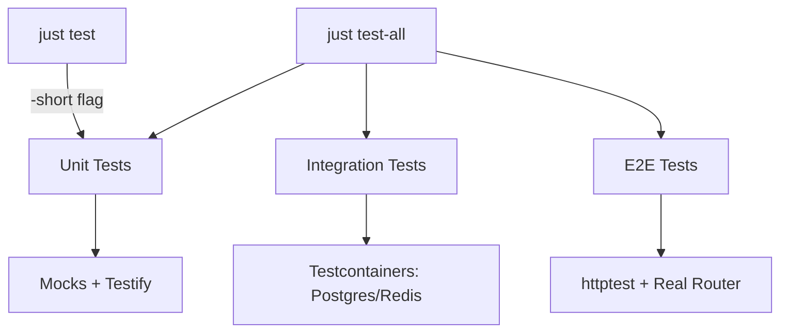
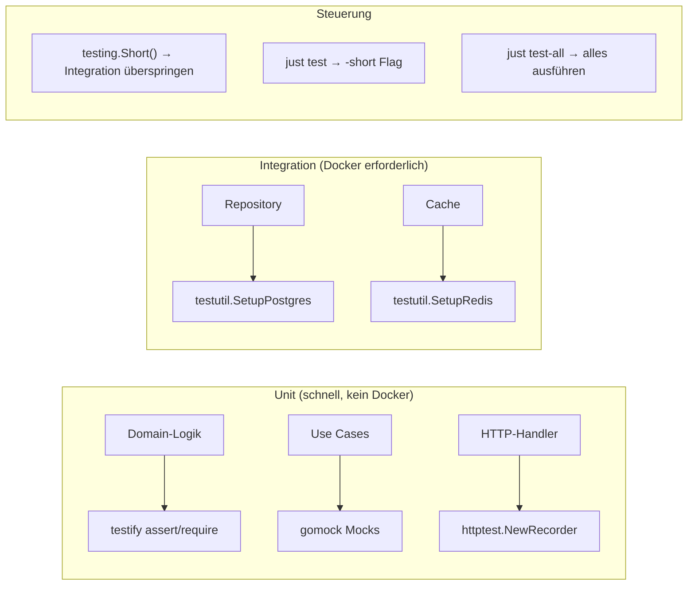

[package_name] verwendet drei Testschichten: Unit-Tests, Integrationstests mit Testcontainers und E2E-Tests über HTTP.



## Tests ausführen

```bash
just test              # nur Unit-Tests (schnell, kein Docker)
just test-all          # alle Tests inklusive Integration
just test-coverage     # HTML-Coverage-Bericht generieren
just test-race         # Race Conditions erkennen
just bench             # Benchmarks
just generate-mocks    # Mock-Dateien neu generieren
```

## Konventionen für Testdateien

| Muster            | Zweck                                          |
| ----------------- | ---------------------------------------------- |
| `*_test.go`       | Testdatei im selben Paket                      |
| `testing.Short()` | Integrationstests in `just test` überspringen  |
| `t.Helper()`      | Funktionen als Testhelfer markieren             |
| `testutil.Setup*` | Container-Setup für Integrationstests          |

## 1. Unit-Tests mit Testify

Verwenden Sie `assert` für nicht-fatale Prüfungen (Test läuft weiter) und `require` für fatale Prüfungen (Test stoppt).

```go
package auth

import (
    "testing"

    "github.com/stretchr/testify/assert"
    "github.com/stretchr/testify/require"
)

func TestValidateRole(t *testing.T) {
    role, err := user.ValidateRole("user")
    require.NoError(t, err)        // fatal: stoppen bei Fehler
    assert.Equal(t, user.RoleUser, role)  // nicht-fatal: weitermachen wenn falsch
}

func TestValidateRole_Invalid(t *testing.T) {
    _, err := user.ValidateRole("superadmin")
    assert.ErrorIs(t, err, user.ErrInvalidRole)
}
```

### Häufige Testify-Assertions

```go
require.NoError(t, err)                    // fatal wenn err != nil
require.NotNil(t, obj)                     // fatal wenn nil
assert.Equal(t, expected, actual)          // Werte vergleichen
assert.NotEqual(t, a, b)                  // Werte unterschiedlich
assert.Contains(t, str, "substring")      // Teilstring prüfen
assert.Len(t, slice, 3)                   // Länge prüfen
assert.True(t, condition)                 // Boolean prüfen
assert.Error(t, err)                      // Fehler erwartet
assert.ErrorIs(t, err, ErrSpecific)       // Fehlertyp prüfen
assert.NotEmpty(t, val)                   // Nicht-leer prüfen
```

### Tabellengesteuerte Tests

```go
func TestUser_CanLogin(t *testing.T) {
    tests := []struct {
        name    string
        user    user.User
        wantErr error
    }{
        {
            name:    "active user can login",
            user:    user.User{IsActive: true},
            wantErr: nil,
        },
        {
            name:    "inactive user cannot login",
            user:    user.User{IsActive: false},
            wantErr: user.ErrUserNotActive,
        },
    }

    for _, tt := range tests {
        t.Run(tt.name, func(t *testing.T) {
            err := tt.user.CanLogin()
            if tt.wantErr != nil {
                assert.ErrorIs(t, err, tt.wantErr)
            } else {
                assert.NoError(t, err)
            }
        })
    }
}
```

## 2. Mocking mit gomock

Mocks werden aus Interfaces mit `go:generate`-Direktiven generiert.

### Mocks generieren

Die Direktive in `internal/user/repository.go`:

```go
//go:generate mockgen -destination=mock/repository.go -package=mock [package_name]/internal/user UserRepository,CredentialsRepository,SessionRepository,MFARepository,VerificationTokenRepository
```

Führen Sie `just generate-mocks` aus, um alle Mocks nach Interface-Änderungen neu zu generieren.

### Mocks in Tests verwenden

```go
package auth_test

import (
    "context"
    "errors"
    "testing"
    "time"

    "github.com/stretchr/testify/assert"
    "github.com/stretchr/testify/require"
    "go.uber.org/mock/gomock"

    "[package_name]/internal/auth"
    "[package_name]/internal/user"
    mock_user "[package_name]/internal/user/mock"
)

func TestRegisterUseCase_Execute(t *testing.T) {
    ctrl := gomock.NewController(t)
    defer ctrl.Finish()

    mockUserRepo := mock_user.NewMockUserRepository(ctrl)
    mockCredRepo := mock_user.NewMockCredentialsRepository(ctrl)
    hasher := auth.NewArgonHasher()

    uc := auth.NewRegisterUseCase(mockUserRepo, mockCredRepo, hasher)

    ctx := context.Background()
    input := auth.RegisterInput{
        Email:    "test@example.com",
        Phone:    "+49555000111",
        Password: "securepassword",
        Role:     "user",
    }

    // Erwartungen einrichten: E-Mail und Telefon existieren noch nicht
    mockUserRepo.EXPECT().
        GetByEmail(ctx, input.Email).
        Return(nil, errors.New("not found"))

    mockUserRepo.EXPECT().
        GetByPhone(ctx, input.Phone).
        Return(nil, errors.New("not found"))

    mockUserRepo.EXPECT().
        Create(ctx, gomock.Any()).
        Return(nil)

    mockCredRepo.EXPECT().
        Create(ctx, gomock.Any()).
        Return(nil)

    out, err := uc.Execute(ctx, input)
    require.NoError(t, err)
    assert.NotEmpty(t, out.UserID)
    assert.Contains(t, out.Message, "Registration successful")
}

func TestRegisterUseCase_EmailExists(t *testing.T) {
    ctrl := gomock.NewController(t)
    defer ctrl.Finish()

    mockUserRepo := mock_user.NewMockUserRepository(ctrl)
    mockCredRepo := mock_user.NewMockCredentialsRepository(ctrl)
    hasher := auth.NewArgonHasher()

    uc := auth.NewRegisterUseCase(mockUserRepo, mockCredRepo, hasher)

    // E-Mail existiert bereits — gibt einen Benutzer zurück (kein Fehler)
    mockUserRepo.EXPECT().
        GetByEmail(gomock.Any(), "taken@example.com").
        Return(&user.User{ID: "existing"}, nil)

    _, err := uc.Execute(context.Background(), auth.RegisterInput{
        Email:    "taken@example.com",
        Phone:    "+49555000222",
        Password: "securepassword",
        Role:     "user",
    })
    assert.ErrorIs(t, err, user.ErrEmailExists)
}
```

### gomock-Matcher

```go
gomock.Any()                          // beliebiger Wert
gomock.Eq("exact")                    // exakte Übereinstimmung
gomock.Not(gomock.Eq("excluded"))     // Negation
gomock.Nil()                          // nil-Übereinstimmung
```

### Aufrufreihenfolge erwarten

```go
first := mockRepo.EXPECT().GetByEmail(gomock.Any(), "a@b.com").Return(nil, errNotFound)
mockRepo.EXPECT().Create(gomock.Any(), gomock.Any()).Return(nil).After(first)
```

## 3. Integrationstests mit Testcontainers

Integrationstests starten echte Docker-Container für Postgres und Redis.

### Teststruktur

```go
func TestUserRepository_Integration(t *testing.T) {
    if testing.Short() {
        t.Skip("skipping integration test")
    }

    // Echten Postgres-Container starten
    dsn, cleanup := testutil.SetupPostgres(t)
    defer cleanup()

    // Mit Datenbank verbinden
    db, err := database.New(dsn)
    require.NoError(t, err)
    defer db.Close()

    // Migrationen ausführen
    // ... Schema anwenden ...

    // Echte Abfragen testen
    repo := postgres.NewUserRepository(db.GetDB())
    ctx := context.Background()

    u := &user.User{
        ID:        ulid.New(),
        Email:     "test@example.com",
        Phone:     "+49555000111",
        Role:      user.RoleUser,
        IsActive:  true,
        CreatedAt: time.Now().UTC(),
        UpdatedAt: time.Now().UTC(),
    }

    err = repo.Create(ctx, u)
    require.NoError(t, err)

    got, err := repo.GetByEmail(ctx, "test@example.com")
    require.NoError(t, err)
    assert.Equal(t, u.ID, got.ID)
    assert.Equal(t, u.Email, got.Email)
}
```

### Helfer: testutil.SetupPostgres

Befindet sich in `internal/testutil/postgres.go`. Gibt einen DSN und eine Cleanup-Funktion zurück:

```go
dsn, cleanup := testutil.SetupPostgres(t)
defer cleanup()
```

Wird automatisch übersprungen, wenn Docker nicht verfügbar ist.

### Helfer: testutil.SetupRedis

Befindet sich in `internal/testutil/redis.go`:

```go
addr, cleanup := testutil.SetupRedis(t)
defer cleanup()
```

## 4. HTTP-Handler-Tests

Verwenden Sie `httptest` mit dem Gin-Router, um HTTP-Endpunkte ohne laufenden Server zu testen.

```go
package server_test

import (
    "net/http"
    "net/http/httptest"
    "testing"

    "github.com/stretchr/testify/assert"
    "go.uber.org/mock/gomock"

    mock_database "[package_name]/internal/database/mock"
)

func TestHealthEndpoint(t *testing.T) {
    ctrl := gomock.NewController(t)
    defer ctrl.Finish()

    mockDB := mock_database.NewMockDB(ctrl)
    s := server.New(cfg, mockDB, log, nil)

    w := httptest.NewRecorder()
    req := httptest.NewRequest(http.MethodGet, "/health", nil)
    s.Router().ServeHTTP(w, req)

    assert.Equal(t, http.StatusOK, w.Code)
    assert.Contains(t, w.Body.String(), `"status":"ok"`)
}
```

### POST-Endpunkte testen

```go
func TestRegisterEndpoint(t *testing.T) {
    // ... Server mit Mocks einrichten ...

    body := `{"email":"a@b.com","phone":"+49555111222","password":"securepass","role":"user"}`

    w := httptest.NewRecorder()
    req := httptest.NewRequest(http.MethodPost, "/auth/register", strings.NewReader(body))
    req.Header.Set("Content-Type", "application/json")
    s.Router().ServeHTTP(w, req)

    assert.Equal(t, http.StatusCreated, w.Code)

    var resp auth.RegisterOutput
    err := json.Unmarshal(w.Body.Bytes(), &resp)
    require.NoError(t, err)
    assert.NotEmpty(t, resp.UserID)
}
```

## 5. E2E Happy Path: Registrieren -> Anmelden -> Token aktualisieren -> Abmelden

Dies zeigt den vollständigen Auth-Ablauf, der Ende-zu-Ende über HTTP getestet wird.

```go
func TestAuthFlow_E2E(t *testing.T) {
    if testing.Short() {
        t.Skip("skipping e2e test")
    }

    dsn, cleanup := testutil.SetupPostgres(t)
    defer cleanup()

    // Echte DB einrichten, Migrationen ausführen, Server mit echten Abhängigkeiten erstellen
    db, err := database.New(dsn)
    require.NoError(t, err)
    defer db.Close()

    // ... Migrationen anwenden, Abhängigkeiten verbinden ...

    router := s.Router()

    // Schritt 1: Registrieren
    regBody := `{"[package_name].kg","phone":"+49700111222","password":"MyStr0ngPass!","role":"user"}`
    w := httptest.NewRecorder()
    req := httptest.NewRequest(http.MethodPost, "/auth/register", strings.NewReader(regBody))
    req.Header.Set("Content-Type", "application/json")
    router.ServeHTTP(w, req)
    assert.Equal(t, http.StatusCreated, w.Code)

    // Schritt 2: Anmelden
    loginBody := `{"[package_name].kg","password":"MyStr0ngPass!"}`
    w = httptest.NewRecorder()
    req = httptest.NewRequest(http.MethodPost, "/auth/login", strings.NewReader(loginBody))
    req.Header.Set("Content-Type", "application/json")
    router.ServeHTTP(w, req)
    assert.Equal(t, http.StatusOK, w.Code)

    var loginResp auth.LoginOutput
    err = json.Unmarshal(w.Body.Bytes(), &loginResp)
    require.NoError(t, err)
    assert.NotEmpty(t, loginResp.Tokens.AccessToken)
    assert.NotEmpty(t, loginResp.Tokens.RefreshToken)

    // Schritt 3: Token aktualisieren
    refreshBody := fmt.Sprintf(`{"refresh_token":"%s"}`, loginResp.Tokens.RefreshToken)
    w = httptest.NewRecorder()
    req = httptest.NewRequest(http.MethodPost, "/auth/refresh", strings.NewReader(refreshBody))
    req.Header.Set("Content-Type", "application/json")
    router.ServeHTTP(w, req)
    assert.Equal(t, http.StatusOK, w.Code)

    var refreshResp auth.TokenPair
    err = json.Unmarshal(w.Body.Bytes(), &refreshResp)
    require.NoError(t, err)
    assert.NotEmpty(t, refreshResp.AccessToken)
    assert.NotEqual(t, loginResp.Tokens.RefreshToken, refreshResp.RefreshToken)

    // Schritt 4: Abmelden
    logoutBody := fmt.Sprintf(`{"refresh_token":"%s"}`, refreshResp.RefreshToken)
    w = httptest.NewRecorder()
    req = httptest.NewRequest(http.MethodPost, "/auth/logout", strings.NewReader(logoutBody))
    req.Header.Set("Content-Type", "application/json")
    router.ServeHTTP(w, req)
    assert.Equal(t, http.StatusOK, w.Code)

    // Schritt 5: Aktualisierung mit altem Token sollte fehlschlagen
    w = httptest.NewRecorder()
    req = httptest.NewRequest(http.MethodPost, "/auth/refresh", strings.NewReader(logoutBody))
    req.Header.Set("Content-Type", "application/json")
    router.ServeHTTP(w, req)
    assert.Equal(t, http.StatusUnauthorized, w.Code)
}
```

## 6. Checkliste kritischer Tests

### Auth-Domain

| Test                               | Typ  | Was geprüft wird                            |
| ---------------------------------- | ---- | ------------------------------------------- |
| Registrierung mit gültigen Daten   | Unit | Benutzer + Anmeldedaten erstellt            |
| Registrierung mit doppelter E-Mail | Unit | Gibt `ErrEmailExists` zurück               |
| Registrierung mit doppeltem Telefon| Unit | Gibt `ErrPhoneExists` zurück               |
| Registrierung mit ungültiger Rolle | Unit | Gibt `ErrInvalidRole` zurück               |
| Anmeldung mit gültigen Daten       | Unit | Gibt Token-Paar zurück                     |
| Anmeldung mit falschem Passwort    | Unit | Gibt `ErrInvalidCredentials` zurück        |
| Anmeldung inaktiver Benutzer       | Unit | Gibt `ErrUserNotActive` zurück             |
| Gültigen Token aktualisieren       | Unit | Alte Session gelöscht, neues Paar ausgegeben|
| Abgelaufene Session aktualisieren  | Unit | Gibt `ErrSessionExpired` zurück            |
| Token-Generierung + Validierung    | Unit | Claims stimmen überein, Ablauf funktioniert |
| Token-Typ-Mismatch                 | Unit | Access-Token als MFA abgelehnt             |
| Passwort-Hash-Einzigartigkeit      | Unit | Gleiches Passwort -> verschiedene Hashes   |

### Infrastruktur

| Test                        | Typ         | Was geprüft wird                         |
| --------------------------- | ----------- | ---------------------------------------- |
| DB-Verbindung + Ping        | Integration | Testcontainer-Postgres funktioniert      |
| Health-Endpunkt              | Unit        | Gibt 200 `{"status":"ok"}` zurück        |
| Request-ID-Middleware        | Unit        | X-Request-ID-Header ist 26-Zeichen-ULID  |
| Graceful Shutdown            | Unit        | Server fährt fehlerfrei herunter         |
| Config-Standardwerte         | Unit        | Sinnvolle Standardwerte geladen          |
| Config-Umgebungsüberschreibung | Unit      | Umgebungsvariablen überschreiben Standardwerte |
| ULID-Einzigartigkeit         | Unit        | Keine Kollisionen über Goroutinen hinweg  |

## 7. Testorganisation

```text
internal/
├── auth/
│   ├── jwt.go
│   ├── jwt_test.go          # Unit: Token-Generierung/-Validierung
│   ├── password.go
│   ├── password_test.go     # Unit: Hash/Verify
│   ├── register.go
│   ├── register_test.go     # Unit: Use Case mit Mocks
│   ├── login.go
│   └── login_test.go        # Unit: Use Case mit Mocks
├── user/
│   ├── entity.go
│   ├── entity_test.go       # Unit: Domain-Logik (CanLogin, usw.)
│   ├── repository.go        # Interfaces (Mock-Quelle)
│   └── mock/
│       └── repository.go    # Generierte Mocks
├── database/
│   ├── database.go
│   ├── database_test.go     # Integration: Testcontainers
│   └── mock/
│       └── database.go      # Generiertes Mock
└── testutil/
    ├── postgres.go           # Testcontainer-Helfer
    └── redis.go              # Testcontainer-Helfer
```

## 8. Kurzreferenz


