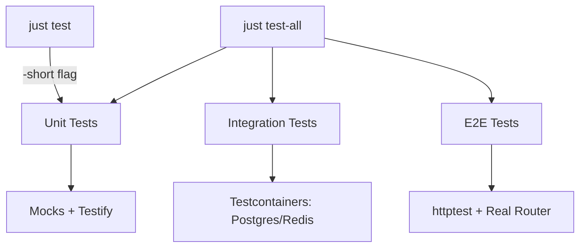
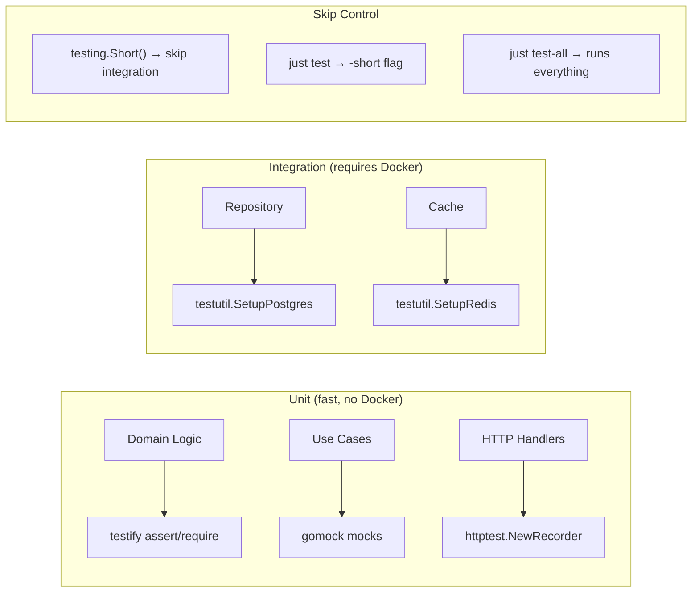

[package_name] üç testtöö qatmaryn qoldonot: unit testter, testcontainers menen integrasijalyq testter cana HTTP arqylu E2E testter.



## Testterdi işletüü

```bash
just test              # unit tests only (fast, no Docker)
just test-all          # all tests including integration
just test-coverage     # generate HTML coverage report
just test-race         # detect race conditions
just bench             # benchmarks
just generate-mocks    # regenerate mock files
```

## Test fajl konvensijalary

| Ülgü              | Maanisi                                      |
| ----------------- | -------------------------------------------- |
| `*_test.go`       | Bir ele pakettegi test fajly                 |
| `testing.Short()` | `just test`'te integrasija testterdi ötkörüü |
| `t.Helper()`      | Funksijalardy test cardamçysy dep belgilöö   |
| `testutil.Setup*` | Integrasija testter üçün kontejner ornottoo  |

## 1. Testify menen unit testter

Fatal emes tekşerüülör üçün `assert` (test ulanat), fatal tekşerüülör üçün `require` (test toqtojt) qoldonuñuz.

```go
package auth

import (
    "testing"

    "github.com/stretchr/testify/assert"
    "github.com/stretchr/testify/require"
)

func TestValidateRole(t *testing.T) {
    role, err := user.ValidateRole("user")
    require.NoError(t, err)        // fatal: stop if error
    assert.Equal(t, user.RoleUser, role)  // non-fatal: continue if wrong
}

func TestValidateRole_Invalid(t *testing.T) {
    _, err := user.ValidateRole("superadmin")
    assert.ErrorIs(t, err, user.ErrInvalidRole)
}
```

### Köp qoldonuluuçu Testify assersijalary

```go
require.NoError(t, err)                    // fatal if err != nil
require.NotNil(t, obj)                     // fatal if nil
assert.Equal(t, expected, actual)          // compare values
assert.NotEqual(t, a, b)                  // values differ
assert.Contains(t, str, "substring")      // substring check
assert.Len(t, slice, 3)                   // length check
assert.True(t, condition)                 // boolean check
assert.Error(t, err)                      // expect error
assert.ErrorIs(t, err, ErrSpecific)       // error type check
assert.NotEmpty(t, val)                   // non-empty check
```

### Tablisa bojunça testter

```go
func TestUser_CanLogin(t *testing.T) {
    tests := []struct {
        name    string
        user    user.User
        wantErr error
    }{
        {
            name:    "active user can login",
            user:    user.User{IsActive: true},
            wantErr: nil,
        },
        {
            name:    "inactive user cannot login",
            user:    user.User{IsActive: false},
            wantErr: user.ErrUserNotActive,
        },
    }

    for _, tt := range tests {
        t.Run(tt.name, func(t *testing.T) {
            err := tt.user.CanLogin()
            if tt.wantErr != nil {
                assert.ErrorIs(t, err, tt.wantErr)
            } else {
                assert.NoError(t, err)
            }
        })
    }
}
```

## 2. gomock menen mocktoo

Mocktar interfejsterden `go:generate` direktivalary arqylu tüzülöt.

### Mocktardy tüzüü

`internal/user/repository.go` içindegi direktiva:

```go
//go:generate mockgen -destination=mock/repository.go -package=mock [package_name]/internal/user UserRepository,CredentialsRepository,SessionRepository,MFARepository,VerificationTokenRepository
```

Interfejs özgörgöndön kiyin bardyq mocktardy qajra tüzüü üçün `just generate-mocks` işletiñiz.

### Testterde mocktardy qoldonuu

```go
package auth_test

import (
    "context"
    "errors"
    "testing"
    "time"

    "github.com/stretchr/testify/assert"
    "github.com/stretchr/testify/require"
    "go.uber.org/mock/gomock"

    "[package_name]/internal/auth"
    "[package_name]/internal/user"
    mock_user "[package_name]/internal/user/mock"
)

func TestRegisterUseCase_Execute(t *testing.T) {
    ctrl := gomock.NewController(t)
    defer ctrl.Finish()

    mockUserRepo := mock_user.NewMockUserRepository(ctrl)
    mockCredRepo := mock_user.NewMockCredentialsRepository(ctrl)
    hasher := auth.NewArgonHasher()

    uc := auth.NewRegisterUseCase(mockUserRepo, mockCredRepo, hasher)

    ctx := context.Background()
    input := auth.RegisterInput{
        Email:    "test@example.com",
        Phone:    "+49555000111",
        Password: "securepassword",
        Role:     "user",
    }

    // Setup expectations: email and phone don't exist yet
    mockUserRepo.EXPECT().
        GetByEmail(ctx, input.Email).
        Return(nil, errors.New("not found"))

    mockUserRepo.EXPECT().
        GetByPhone(ctx, input.Phone).
        Return(nil, errors.New("not found"))

    mockUserRepo.EXPECT().
        Create(ctx, gomock.Any()).
        Return(nil)

    mockCredRepo.EXPECT().
        Create(ctx, gomock.Any()).
        Return(nil)

    out, err := uc.Execute(ctx, input)
    require.NoError(t, err)
    assert.NotEmpty(t, out.UserID)
    assert.Contains(t, out.Message, "Registration successful")
}

func TestRegisterUseCase_EmailExists(t *testing.T) {
    ctrl := gomock.NewController(t)
    defer ctrl.Finish()

    mockUserRepo := mock_user.NewMockUserRepository(ctrl)
    mockCredRepo := mock_user.NewMockCredentialsRepository(ctrl)
    hasher := auth.NewArgonHasher()

    uc := auth.NewRegisterUseCase(mockUserRepo, mockCredRepo, hasher)

    // Email already exists - return a user (no error)
    mockUserRepo.EXPECT().
        GetByEmail(gomock.Any(), "taken@example.com").
        Return(&user.User{ID: "existing"}, nil)

    _, err := uc.Execute(context.Background(), auth.RegisterInput{
        Email:    "taken@example.com",
        Phone:    "+49555000222",
        Password: "securepassword",
        Role:     "user",
    })
    assert.ErrorIs(t, err, user.ErrEmailExists)
}
```

### gomock matçerleri

```go
gomock.Any()                          // match any value
gomock.Eq("exact")                    // exact match
gomock.Not(gomock.Eq("excluded"))     // negation
gomock.Nil()                          // match nil
```

### Çaqyruu tartibin kütüü

```go
first := mockRepo.EXPECT().GetByEmail(gomock.Any(), "a@b.com").Return(nil, errNotFound)
mockRepo.EXPECT().Create(gomock.Any(), gomock.Any()).Return(nil).After(first)
```

## 3. Testcontainers menen integrasijalyq testter

Integrasijalyq testter Postgres cana Redis üçün çynyqy Docker kontejnerlerdi baştajt.

### Test strukturasy

```go
func TestUserRepository_Integration(t *testing.T) {
    if testing.Short() {
        t.Skip("skipping integration test")
    }

    // Start real Postgres container
    dsn, cleanup := testutil.SetupPostgres(t)
    defer cleanup()

    // Connect to database
    db, err := database.New(dsn)
    require.NoError(t, err)
    defer db.Close()

    // Run migrations
    // ... apply schema ...

    // Test real queries
    repo := postgres.NewUserRepository(db.GetDB())
    ctx := context.Background()

    u := &user.User{
        ID:        ulid.New(),
        Email:     "test@example.com",
        Phone:     "+49555000111",
        Role:      user.RoleUser,
        IsActive:  true,
        CreatedAt: time.Now().UTC(),
        UpdatedAt: time.Now().UTC(),
    }

    err = repo.Create(ctx, u)
    require.NoError(t, err)

    got, err := repo.GetByEmail(ctx, "test@example.com")
    require.NoError(t, err)
    assert.Equal(t, u.ID, got.ID)
    assert.Equal(t, u.Email, got.Email)
}
```

### Cardamçy: testutil.SetupPostgres

`internal/testutil/postgres.go` içinde cajğaşqan. DSN cana cleanup funksijasyn qajtarat:

```go
dsn, cleanup := testutil.SetupPostgres(t)
defer cleanup()
```

Docker cetkiliktüü emes bolğonda avtomattyq ötkörülöt.

### Cardamçy: testutil.SetupRedis

`internal/testutil/redis.go` içinde cajğaşqan:

```go
addr, cleanup := testutil.SetupRedis(t)
defer cleanup()
```

## 4. HTTP Handler testteri

Server işletpestan HTTP endpoint'terdi testtöö üçün Gin router menen `httptest` qoldonuñuz.

```go
package server_test

import (
    "net/http"
    "net/http/httptest"
    "testing"

    "github.com/stretchr/testify/assert"
    "go.uber.org/mock/gomock"

    mock_database "[package_name]/internal/database/mock"
)

func TestHealthEndpoint(t *testing.T) {
    ctrl := gomock.NewController(t)
    defer ctrl.Finish()

    mockDB := mock_database.NewMockDB(ctrl)
    s := server.New(cfg, mockDB, log, nil)

    w := httptest.NewRecorder()
    req := httptest.NewRequest(http.MethodGet, "/health", nil)
    s.Router().ServeHTTP(w, req)

    assert.Equal(t, http.StatusOK, w.Code)
    assert.Contains(t, w.Body.String(), `"status":"ok"`)
}
```

### POST endpoint'terdi testtöö

```go
func TestRegisterEndpoint(t *testing.T) {
    // ... setup server with mocks ...

    body := `{"email":"a@b.com","phone":"+49555111222","password":"securepass","role":"user"}`

    w := httptest.NewRecorder()
    req := httptest.NewRequest(http.MethodPost, "/auth/register", strings.NewReader(body))
    req.Header.Set("Content-Type", "application/json")
    s.Router().ServeHTTP(w, req)

    assert.Equal(t, http.StatusCreated, w.Code)

    var resp auth.RegisterOutput
    err := json.Unmarshal(w.Body.Bytes(), &resp)
    require.NoError(t, err)
    assert.NotEmpty(t, resp.UserID)
}
```

## 5. E2E toluq col: Register -> Login -> Refresh -> Logout

Bul HTTP arqylu toluq auth ağymyn end-to-end testtöönü körsötöt.

```go
func TestAuthFlow_E2E(t *testing.T) {
    if testing.Short() {
        t.Skip("skipping e2e test")
    }

    dsn, cleanup := testutil.SetupPostgres(t)
    defer cleanup()

    // Setup real DB, run migrations, create server with real deps
    db, err := database.New(dsn)
    require.NoError(t, err)
    defer db.Close()

    // ... apply migrations, wire dependencies ...

    router := s.Router()

    // Step 1: Register
    regBody := `{"[package_name].kg","phone":"+49700111222","password":"MyStr0ngPass!","role":"user"}`
    w := httptest.NewRecorder()
    req := httptest.NewRequest(http.MethodPost, "/auth/register", strings.NewReader(regBody))
    req.Header.Set("Content-Type", "application/json")
    router.ServeHTTP(w, req)
    assert.Equal(t, http.StatusCreated, w.Code)

    // Step 2: Login
    loginBody := `{"[package_name].kg","password":"MyStr0ngPass!"}`
    w = httptest.NewRecorder()
    req = httptest.NewRequest(http.MethodPost, "/auth/login", strings.NewReader(loginBody))
    req.Header.Set("Content-Type", "application/json")
    router.ServeHTTP(w, req)
    assert.Equal(t, http.StatusOK, w.Code)

    var loginResp auth.LoginOutput
    err = json.Unmarshal(w.Body.Bytes(), &loginResp)
    require.NoError(t, err)
    assert.NotEmpty(t, loginResp.Tokens.AccessToken)
    assert.NotEmpty(t, loginResp.Tokens.RefreshToken)

    // Step 3: Refresh token
    refreshBody := fmt.Sprintf(`{"refresh_token":"%s"}`, loginResp.Tokens.RefreshToken)
    w = httptest.NewRecorder()
    req = httptest.NewRequest(http.MethodPost, "/auth/refresh", strings.NewReader(refreshBody))
    req.Header.Set("Content-Type", "application/json")
    router.ServeHTTP(w, req)
    assert.Equal(t, http.StatusOK, w.Code)

    var refreshResp auth.TokenPair
    err = json.Unmarshal(w.Body.Bytes(), &refreshResp)
    require.NoError(t, err)
    assert.NotEmpty(t, refreshResp.AccessToken)
    assert.NotEqual(t, loginResp.Tokens.RefreshToken, refreshResp.RefreshToken)

    // Step 4: Logout
    logoutBody := fmt.Sprintf(`{"refresh_token":"%s"}`, refreshResp.RefreshToken)
    w = httptest.NewRecorder()
    req = httptest.NewRequest(http.MethodPost, "/auth/logout", strings.NewReader(logoutBody))
    req.Header.Set("Content-Type", "application/json")
    router.ServeHTTP(w, req)
    assert.Equal(t, http.StatusOK, w.Code)

    // Step 5: Refresh with old token should fail
    w = httptest.NewRecorder()
    req = httptest.NewRequest(http.MethodPost, "/auth/refresh", strings.NewReader(logoutBody))
    req.Header.Set("Content-Type", "application/json")
    router.ServeHTTP(w, req)
    assert.Equal(t, http.StatusUnauthorized, w.Code)
}
```

## 6. Maanilüü testter tizmesi

### Auth domeni

| Test                             | Türü | Emne tekşeret                           |
| -------------------------------- | ---- | --------------------------------------- |
| Caraqtuu maalymat menen qattoo   | Unit | Qoldonuuçu + credentials tüzülgön       |
| Qajtalanğan email menen qattoo   | Unit | `ErrEmailExists` qajtarat               |
| Qajtalanğan telefon menen qattoo | Unit | `ErrPhoneExists` qajtarat               |
| Caraqsyz rol menen qattoo        | Unit | `ErrInvalidRole` qajtarat               |
| Tuura credentials menen login    | Unit | Token cuptun qajtarat                   |
| Kata syr söz menen login         | Unit | `ErrInvalidCredentials` qajtarat        |
| Aktivdüü emes qoldonuuçu login   | Unit | `ErrUserNotActive` qajtarat             |
| Caraqtuu token menen cañyloo     | Unit | Eski sessija öçürülöt, cañy cup berilet |
| Möönötü ötkön sessija            | Unit | `ErrSessionExpired` qajtarat            |
| Token tüzüü + validasija         | Unit | Claims tuura kelet, möönötü işlejt      |
| Token türü dal kelbestik         | Unit | Access token MFA katary qabyl alynbajt  |
| Syr söz hash unikalduğu          | Unit | Bir ele syr söz -> başqa hashter        |

### Infrastruktura

| Test                  | Türü        | Emne tekşeret                        |
| --------------------- | ----------- | ------------------------------------ |
| DB bajlanuş + ping    | Integrasija | Testcontainer Postgres iştejt        |
| Health endpoint       | Unit        | 200 `{"status":"ok"}` qajtarat       |
| Request ID middleware | Unit        | X-Request-ID header 26 tamğalu ULID  |
| Aqyryn toqtoo         | Unit        | Server qatasyz toqtojt               |
| Config default'toru   | Unit        | Aqylğa sujğan defaulttar cüktölöt    |
| Config env override   | Unit        | Env vars defaulttardy almaştyrat     |
| ULID unikalduğu       | Unit        | Goroutine'dar arasynda qağyluşuu coq |

## 7. Test uüşturuluşu

```text
internal/
├── auth/
│   ├── jwt.go
│   ├── jwt_test.go          # unit: token gen/validation
│   ├── password.go
│   ├── password_test.go     # unit: hash/verify
│   ├── register.go
│   ├── register_test.go     # unit: use case with mocks
│   ├── login.go
│   └── login_test.go        # unit: use case with mocks
├── user/
│   ├── entity.go
│   ├── entity_test.go       # unit: domain logic (CanLogin, etc.)
│   ├── repository.go        # interfaces (mock source)
│   └── mock/
│       └── repository.go    # generated mocks
├── database/
│   ├── database.go
│   ├── database_test.go     # integration: testcontainers
│   └── mock/
│       └── database.go      # generated mock
└── testutil/
    ├── postgres.go           # testcontainer helper
    └── redis.go              # testcontainer helper
```

## 8. Tez maalymat


