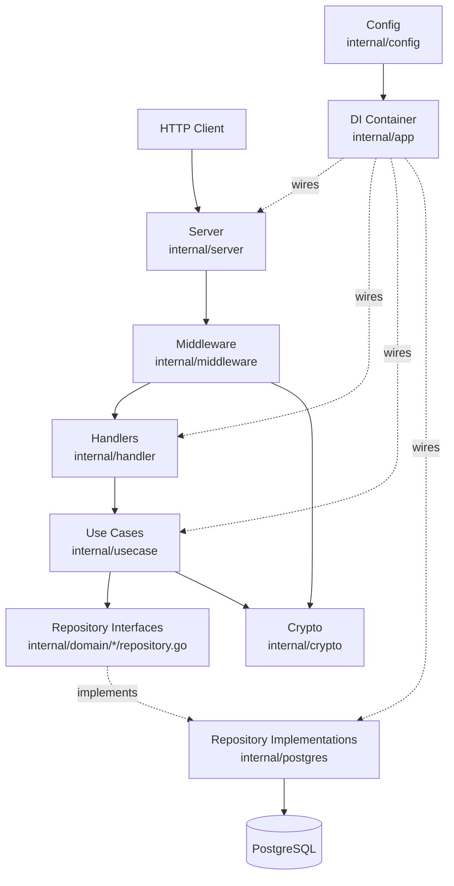
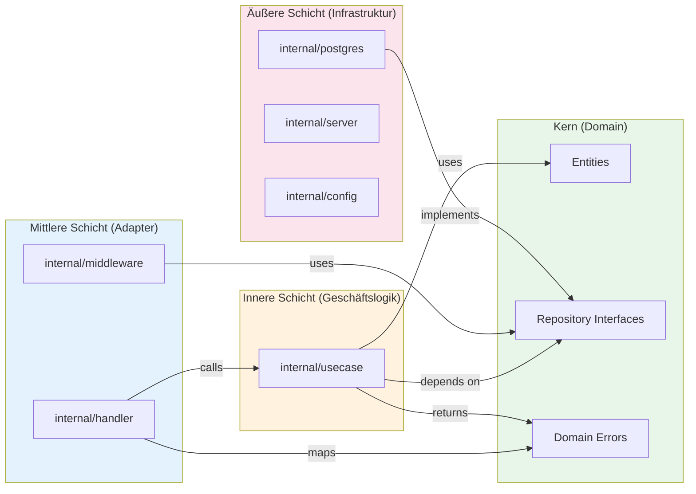
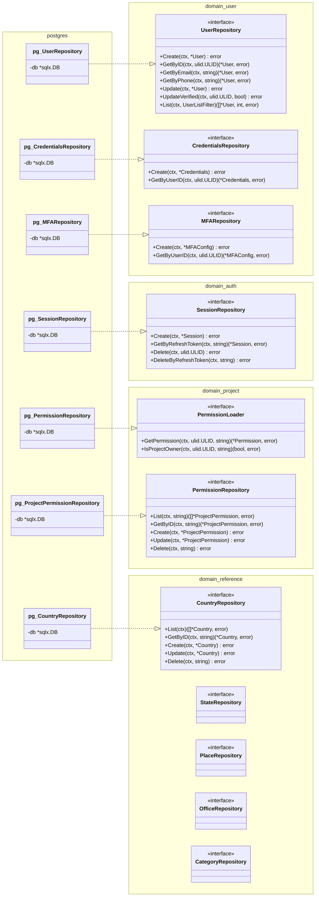
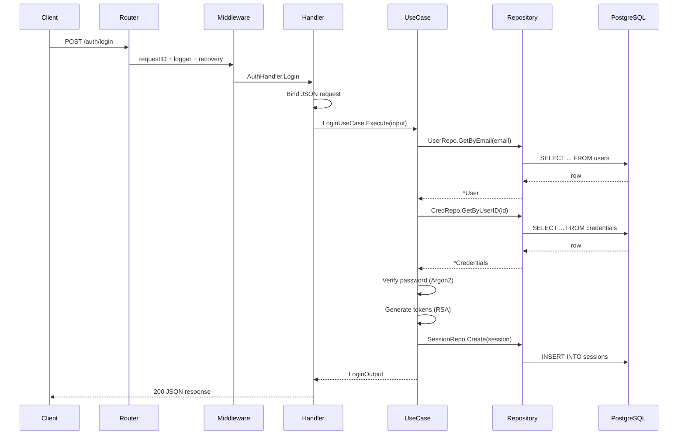
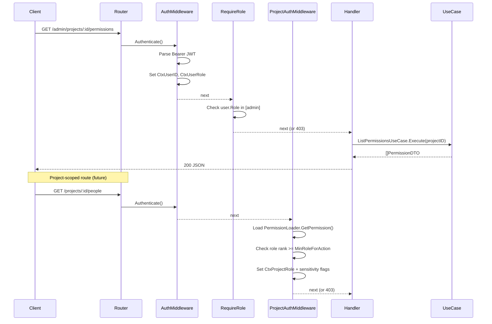
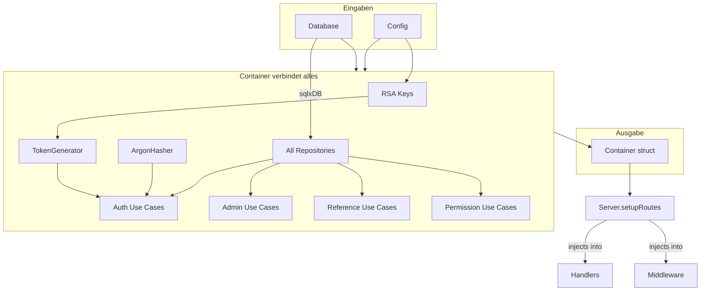

Diese Seite richtet sich an Entwickler und technische Mitarbeiter, die verstehen möchten, wie Observer aufgebaut ist. Wenn Sie als Administrator Observer für Ihre Organisation einrichten, können Sie dies überspringen — gehen Sie stattdessen zur [Bereitstellung](/docs/guide/deployment/).

## Überblick

Jede HTTP-Anfrage durchläuft denselben Pfad: Sie erreicht den Server, passiert Middleware (Authentifizierung, Logging), gelangt zu einem Handler, der an einen Use Case delegiert, und der Use Case kommuniziert über ein Repository mit der Datenbank. Konfiguration und Dependency Injection verbinden beim Start alles miteinander.

## Abhängigkeitsfluss (Clean Architecture)

Die Codebasis ist in Schichten organisiert. Innere Schichten definieren die Regeln, äußere Schichten stellen die Infrastruktur bereit. Abhängigkeiten zeigen immer nach innen — Geschäftslogik importiert nie direkt Datenbank- oder HTTP-Code. Dadurch können Use Cases ohne laufende Datenbank getestet werden.

## Repository: Interface zu Implementierung

Domain-Code definiert, _welche_ Datenoperationen benötigt werden (Interfaces), während die PostgreSQL-Schicht das _Wie_ bereitstellt (Implementierungen). Diese Trennung bedeutet, dass Sie PostgreSQL gegen eine andere Datenbank austauschen könnten, ohne Geschäftslogik zu berühren. Jeder Domain-Bereich — Benutzer, Auth, Projekte, Referenzdaten — hat sein eigenes Repository-Interface.

## Use Cases: Wer hängt wovon ab

Jede Benutzeraktion — Anmelden, Personen auflisten, Berechtigungen zuweisen — wird von einem dedizierten Use Case behandelt. Use Cases koordinieren zwischen Repositories und Crypto-Services, enthalten aber selbst keinen HTTP- oder Datenbankcode. Das folgende Diagramm zeigt, von welchen Repositories jeder Use Case abhängt.

```mermaid
graph TD
    subgraph auth_usecases["Auth Use Cases"]
        REG[RegisterUseCase]
        LOG[LoginUseCase]
        REF[RefreshTokenUseCase]
        OUT[LogoutUseCase]
    end

    subgraph admin_usecases["Admin Use Cases"]
        LU[ListUsersUseCase]
        GU[GetUserUseCase]
        UU[UpdateUserUseCase]
    end

    subgraph perm_usecases["Permission Use Cases"]
        LP[ListPermissionsUseCase]
        AP[AssignPermissionUseCase]
        UP[UpdatePermissionUseCase]
        RP[RevokePermissionUseCase]
    end

    subgraph ref_usecases["Reference Use Cases"]
        COU[CountryUseCase]
        STA[StateUseCase]
        PLA[PlaceUseCase]
        OFF[OfficeUseCase]
        CAT[CategoryUseCase]
    end

    subgraph interfaces["Repository Interfaces"]
        UR[UserRepository]
        CR[CredentialsRepository]
        SR[SessionRepository]
        MR[MFARepository]
        PR[PermissionRepository]
        COR[CountryRepository]
        STR[StateRepository]
        PLR[PlaceRepository]
        OFR[OfficeRepository]
        CAR[CategoryRepository]
    end

    subgraph crypto["Crypto Services"]
        PH[PasswordHasher]
        TG[TokenGenerator]
    end

    REG --> UR
    REG --> CR
    REG --> PH

    LOG --> UR
    LOG --> CR
    LOG --> SR
    LOG --> MR
    LOG --> PH
    LOG --> TG

    REF --> SR
    REF --> TG

    OUT --> SR

    LU --> UR
    GU --> UR
    UU --> UR

    LP --> PR
    AP --> PR
    UP --> PR
    RP --> PR

    COU --> COR
    STA --> STR
    PLA --> PLR
    OFF --> OFR
    CAT --> CAR
```

## HTTP-Anfragefluss

Hier sehen Sie, was passiert, wenn sich ein Benutzer anmeldet. Die Anfrage kommt über den Router, passiert Middleware, die eine Request-ID und einen Logger zuweist, und erreicht dann den Auth-Handler. Der Handler parst den JSON-Body und ruft den Login-Use-Case auf, der den Benutzer nachschlägt, das Passwort mit Argon2 verifiziert, JWT-Tokens generiert und eine Session erstellt.

## Geschützte Routen (Admin + Project RBAC)

Geschützte Routen durchlaufen zusätzliche Prüfungen. Admin-Routen verifizieren die Plattformrolle des Benutzers (Admin, Mitarbeiter usw.). Projektbezogene Routen laden die Projektberechtigung des Benutzers und prüfen, ob seine Projektrolle für die angeforderte Aktion ausreicht. Die Middleware setzt außerdem Sensitivitätsstufen, die steuern, ob die Antwort Kontaktdaten, persönliche Details oder Dokumentdaten enthält.

## DI Container Wiring

Beim Start liest die Anwendung die Konfiguration und verbindet sich mit der Datenbank, dann wird alles in einem Dependency-Injection-Container zusammengebaut. Der Container erstellt Repositories, Crypto-Services und Use Cases und übergibt jeder Komponente ihre Abhängigkeiten. Der vollständig zusammengebaute Container wird an den Server übergeben, der Handler und Middleware in den Router einbindet.

