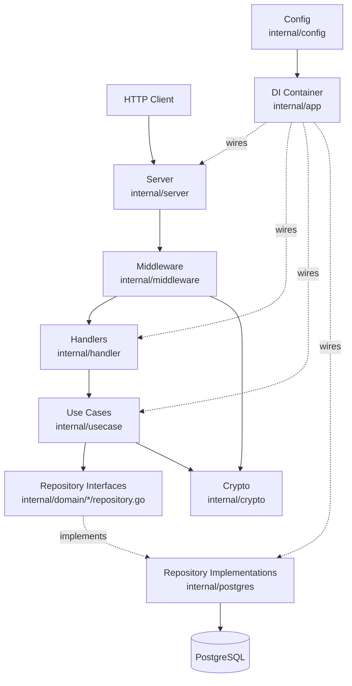
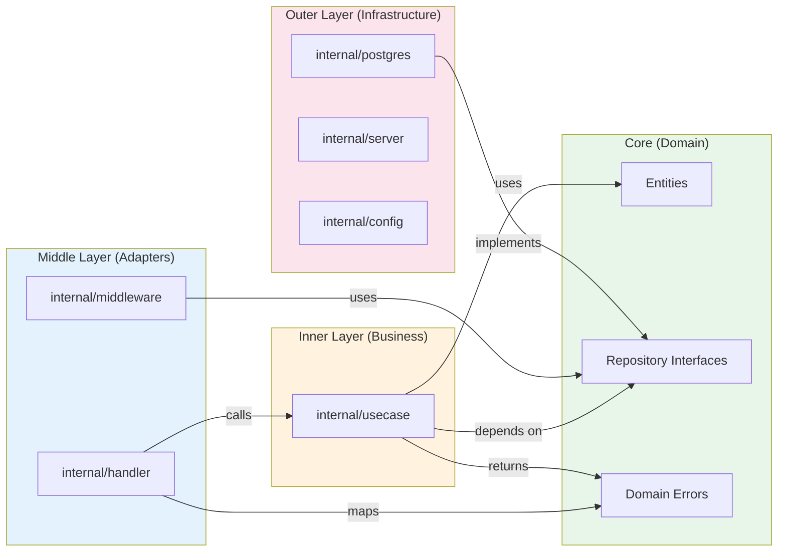
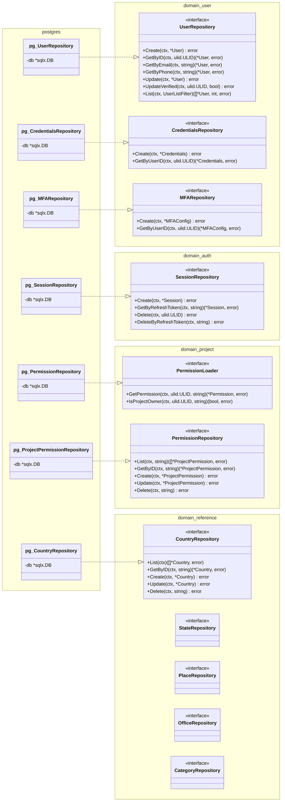
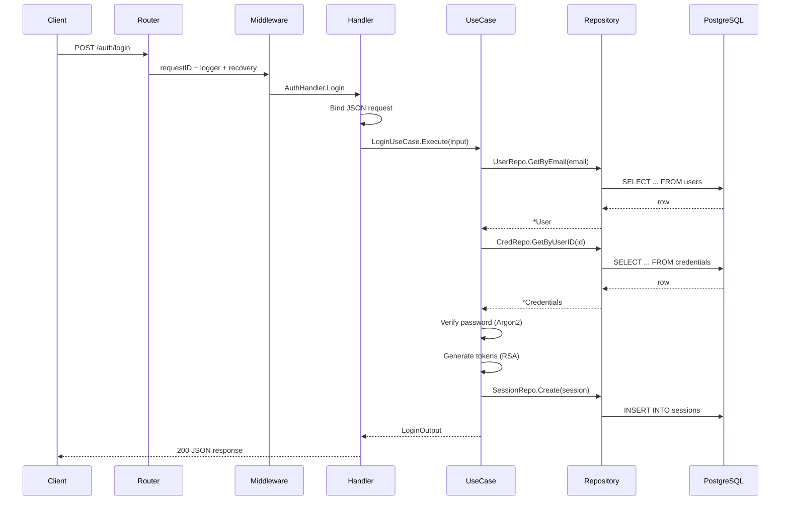
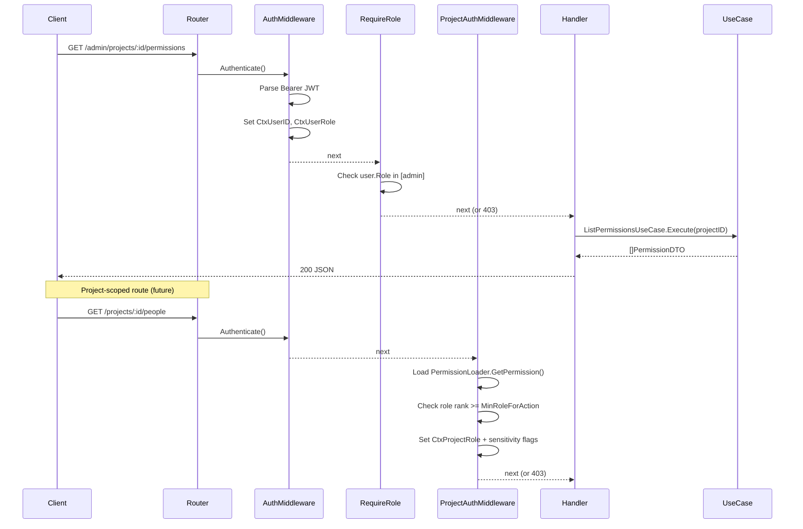
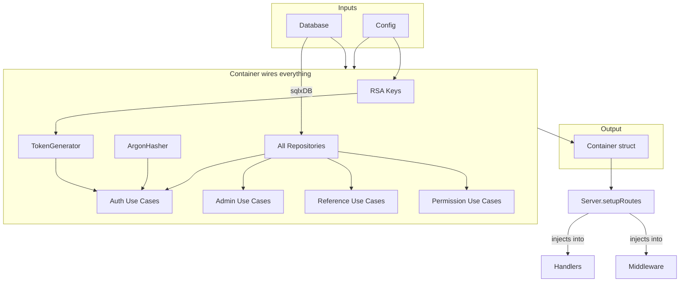

Bu sayfa, Observer'ın nasıl inşa edildiğini anlamak isteyen geliştiriciler ve teknik personel içindir. Kuruluşunuz için Observer kuran bir yöneticiyseniz, bunu atlayabilirsiniz — bunun yerine [Dağıtım](/docs/guide/deployment/) sayfasına gidin.

## Genel Bakış

Her HTTP isteği aynı yolu izler: sunucuya girer, middleware'den (kimlik doğrulama, günlükleme) geçer, bir use case'e delege eden bir handler'a ulaşır ve use case, veritabanıyla bir repository aracılığıyla iletişim kurar. Yapılandırma ve bağımlılık enjeksiyonu başlangıçta her şeyi bir araya getirir.

## Bağımlılık Akışı (Clean Architecture)

Kod tabanı katmanlar halinde organize edilmiştir. İç katmanlar kuralları tanımlar, dış katmanlar altyapıyı sağlar. Bağımlılıklar her zaman içe doğru yönelir — iş mantığı hiçbir zaman veritabanı veya HTTP kodunu doğrudan içe aktarmaz. Bu, use case'lerin çalışan bir veritabanı olmadan test edilmesini mümkün kılar.

## Repository: Arayüzden Uygulamaya

Domain kodu, hangi veri işlemlerinin gerekli olduğunu (arayüzler) tanımlarken, PostgreSQL katmanı _nasıl_ yapılacağını (uygulamalar) sağlar. Bu ayrım, herhangi bir iş mantığına dokunmadan PostgreSQL'i başka bir veritabanıyla değiştirebileceğiniz anlamına gelir. Her domain alanı — kullanıcılar, kimlik doğrulama, projeler, referans verileri — kendi repository arayüzüne sahiptir.

## Use Case'ler: Kim Neye Bağlı

Her kullanıcı eylemi — giriş yapma, kişileri listeleme, izin atama — özel bir use case tarafından yönetilir. Use case'ler repository'ler ve crypto hizmetleri arasında koordinasyon sağlar ancak kendileri HTTP veya veritabanı kodu içermez. Aşağıdaki diyagram, her use case'in hangi repository'lere bağlı olduğunu gösterir.

```mermaid
graph TD
    subgraph auth_usecases["Auth Use Cases"]
        REG[RegisterUseCase]
        LOG[LoginUseCase]
        REF[RefreshTokenUseCase]
        OUT[LogoutUseCase]
    end

    subgraph admin_usecases["Admin Use Cases"]
        LU[ListUsersUseCase]
        GU[GetUserUseCase]
        UU[UpdateUserUseCase]
    end

    subgraph perm_usecases["Permission Use Cases"]
        LP[ListPermissionsUseCase]
        AP[AssignPermissionUseCase]
        UP[UpdatePermissionUseCase]
        RP[RevokePermissionUseCase]
    end

    subgraph ref_usecases["Reference Use Cases"]
        COU[CountryUseCase]
        STA[StateUseCase]
        PLA[PlaceUseCase]
        OFF[OfficeUseCase]
        CAT[CategoryUseCase]
    end

    subgraph interfaces["Repository Interfaces"]
        UR[UserRepository]
        CR[CredentialsRepository]
        SR[SessionRepository]
        MR[MFARepository]
        PR[PermissionRepository]
        COR[CountryRepository]
        STR[StateRepository]
        PLR[PlaceRepository]
        OFR[OfficeRepository]
        CAR[CategoryRepository]
    end

    subgraph crypto["Crypto Services"]
        PH[PasswordHasher]
        TG[TokenGenerator]
    end

    REG --> UR
    REG --> CR
    REG --> PH

    LOG --> UR
    LOG --> CR
    LOG --> SR
    LOG --> MR
    LOG --> PH
    LOG --> TG

    REF --> SR
    REF --> TG

    OUT --> SR

    LU --> UR
    GU --> UR
    UU --> UR

    LP --> PR
    AP --> PR
    UP --> PR
    RP --> PR

    COU --> COR
    STA --> STR
    PLA --> PLR
    OFF --> OFR
    CAT --> CAR
```

## HTTP İstek Akışı

Bir kullanıcı giriş yaptığında olan budur. İstek router'dan girer, istek kimliği ve günlükçü atayan middleware'den geçer, ardından auth handler'a ulaşır. Handler, JSON gövdesini ayrıştırır ve login use case'i çağırır; bu use case kullanıcıyı arar, Argon2 ile parolayı doğrular, JWT token'ları oluşturur ve bir oturum yaratır.

## Korumalı Rota Akışı (Admin + Proje RBAC)

Korumalı rotalar ek kontrollerden geçer. Admin rotaları, kullanıcının platform rolünü (admin, staff vb.) doğrular. Proje kapsamlı rotalar, kullanıcının proje düzeyindeki iznini yükler ve proje rolünün istenen eylem için yeterli olup olmadığını kontrol eder. Middleware ayrıca yanıtın iletişim bilgilerini, kişisel detayları veya belge verilerini içerip içermediğini kontrol eden hassasiyet bayrakları belirler.

## DI Container Bağlantısı

Başlangıçta uygulama, yapılandırmayı okur ve veritabanına bağlanır, ardından her şeyi bir bağımlılık enjeksiyonu konteynerinde birbirine bağlar. Konteyner; repository'leri, crypto hizmetlerini ve use case'leri oluşturarak her bileşene bağımlılıklarını iletir. Tamamen monte edilmiş konteyner, handler'ları ve middleware'i router'a enjekte eden sunucuya teslim edilir.

