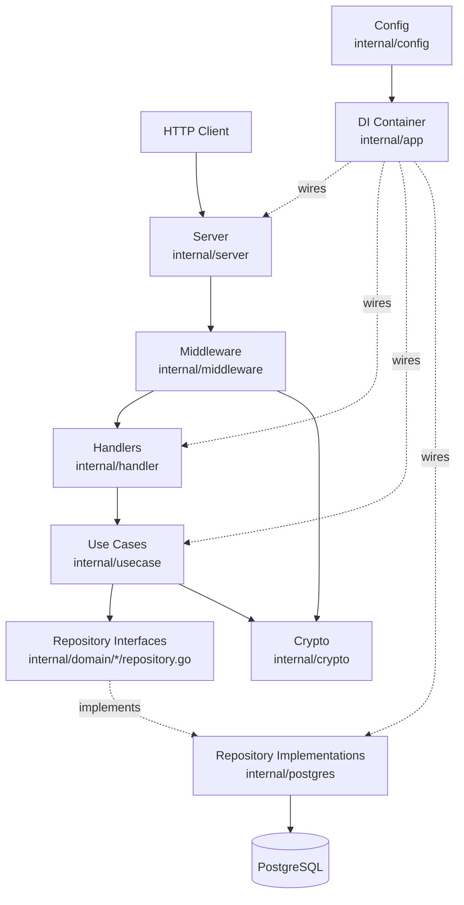
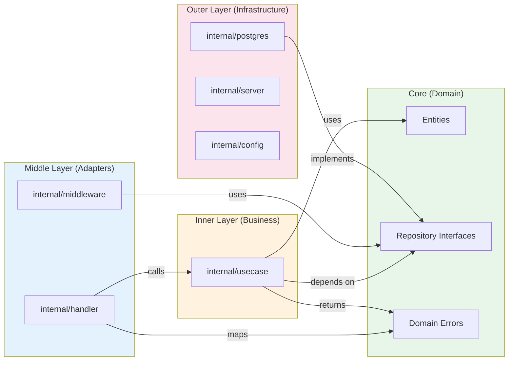
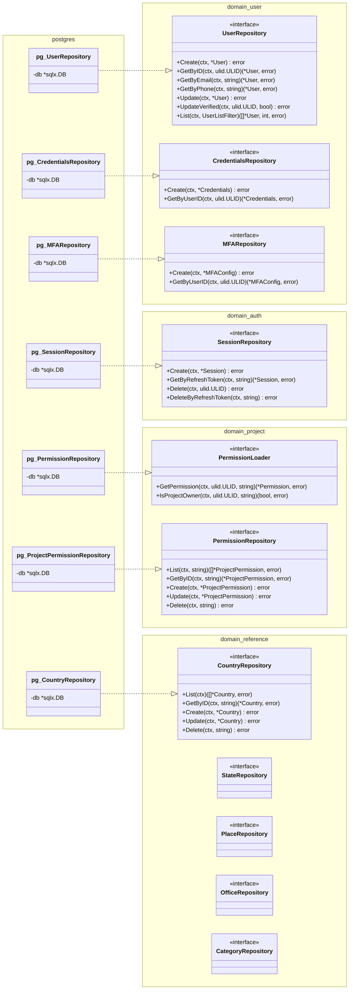
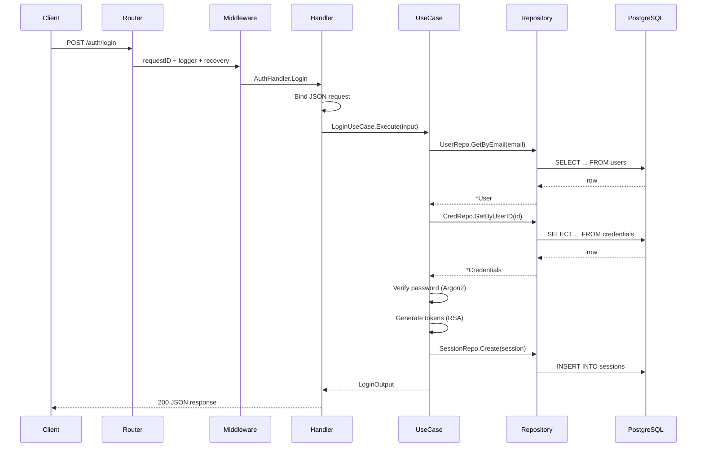
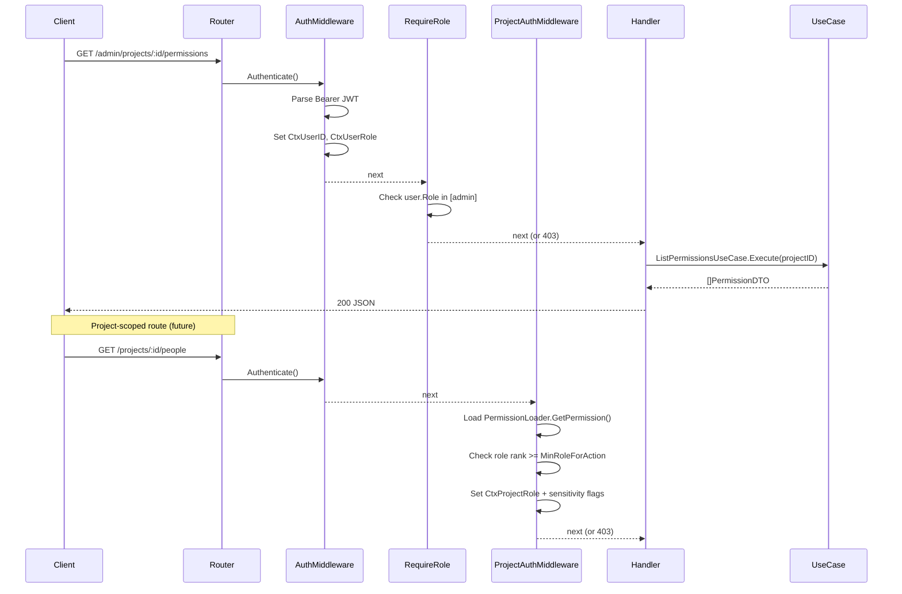
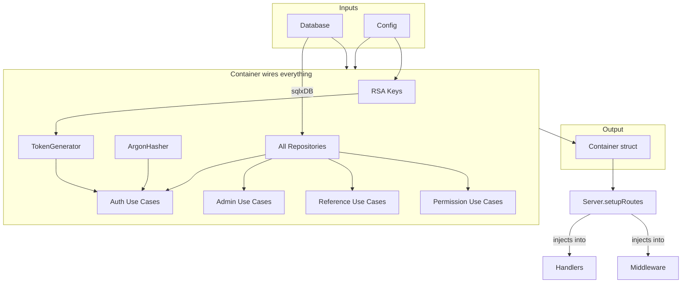

Ця сторінка призначена для розробників та технічного персоналу, які хочуть зрозуміти, як побудований Observer. Якщо ви адміністратор, що налаштовує Observer для вашої організації, можете пропустити це — перейдіть до [Розгортання](/docs/guide/deployment/).

## Загальний огляд

Кожний HTTP-запит проходить однаковий шлях: він надходить на сервер, проходить через middleware (автентифікація, логування), потрапляє до обробника, який делегує виконання use case, а use case взаємодіє з базою даних через репозиторій. Конфігурація та впровадження залежностей пов'язують все разом при запуску.

## Потік залежностей (Чиста архітектура)

Кодова база організована в шари. Внутрішні шари визначають правила, зовнішні надають інфраструктуру. Залежності завжди спрямовані всередину — бізнес-логіка ніколи не імпортує код бази даних або HTTP напряму. Це дозволяє тестувати use cases без працюючої бази даних.

## Репозиторій: від інтерфейсу до реалізації

Доменний код визначає _які_ операції з даними потрібні (інтерфейси), тоді як шар PostgreSQL надає _як_ (реалізації). Це розділення означає, що ви можете замінити PostgreSQL на іншу базу даних, не торкаючись жодної бізнес-логіки. Кожна доменна область — користувачі, авторизація, проєкти, довідкові дані — має власний інтерфейс репозиторію.

## Use Cases: хто від чого залежить

Кожна дія користувача — вхід у систему, перегляд списку людей, призначення дозволів — обробляється окремим use case. Use cases координують роботу між репозиторіями та криптографічними сервісами, але самі не містять HTTP або код бази даних. Діаграма нижче показує, від яких репозиторіїв залежить кожний use case.

```mermaid
graph TD
    subgraph auth_usecases["Auth Use Cases"]
        REG[RegisterUseCase]
        LOG[LoginUseCase]
        REF[RefreshTokenUseCase]
        OUT[LogoutUseCase]
    end

    subgraph admin_usecases["Admin Use Cases"]
        LU[ListUsersUseCase]
        GU[GetUserUseCase]
        UU[UpdateUserUseCase]
    end

    subgraph perm_usecases["Permission Use Cases"]
        LP[ListPermissionsUseCase]
        AP[AssignPermissionUseCase]
        UP[UpdatePermissionUseCase]
        RP[RevokePermissionUseCase]
    end

    subgraph ref_usecases["Reference Use Cases"]
        COU[CountryUseCase]
        STA[StateUseCase]
        PLA[PlaceUseCase]
        OFF[OfficeUseCase]
        CAT[CategoryUseCase]
    end

    subgraph interfaces["Repository Interfaces"]
        UR[UserRepository]
        CR[CredentialsRepository]
        SR[SessionRepository]
        MR[MFARepository]
        PR[PermissionRepository]
        COR[CountryRepository]
        STR[StateRepository]
        PLR[PlaceRepository]
        OFR[OfficeRepository]
        CAR[CategoryRepository]
    end

    subgraph crypto["Crypto Services"]
        PH[PasswordHasher]
        TG[TokenGenerator]
    end

    REG --> UR
    REG --> CR
    REG --> PH

    LOG --> UR
    LOG --> CR
    LOG --> SR
    LOG --> MR
    LOG --> PH
    LOG --> TG

    REF --> SR
    REF --> TG

    OUT --> SR

    LU --> UR
    GU --> UR
    UU --> UR

    LP --> PR
    AP --> PR
    UP --> PR
    RP --> PR

    COU --> COR
    STA --> STR
    PLA --> PLR
    OFF --> OFR
    CAT --> CAR
```

## Потік HTTP-запиту

Ось що відбувається, коли користувач входить у систему. Запит надходить через маршрутизатор, проходить через middleware, який призначає ідентифікатор запиту та логер, потім потрапляє до обробника авторизації. Обробник розбирає JSON-тіло та викликає use case входу, який шукає користувача, перевіряє пароль за допомогою Argon2, генерує JWT-токени та створює сесію.

## Потік захищених маршрутів (Admin + Project RBAC)

Захищені маршрути проходять додаткові перевірки. Адміністративні маршрути перевіряють платформну роль користувача (admin, staff тощо). Маршрути на рівні проєкту завантажують дозволи користувача на рівні проєкту та перевіряють, чи достатня його проєктна роль для запитуваної дії. Middleware також встановлює прапорці конфіденційності, що контролюють, чи включає відповідь контактну інформацію, персональні дані або дані документів.

## Зв'язування DI-контейнера

При запуску додаток зчитує конфігурацію та підключається до бази даних, потім зв'язує все разом у контейнері впровадження залежностей. Контейнер створює репозиторії, криптографічні сервіси та use cases, передаючи кожному компоненту його залежності. Повністю зібраний контейнер передається серверу, який впроваджує обробники та middleware у маршрутизатор.

